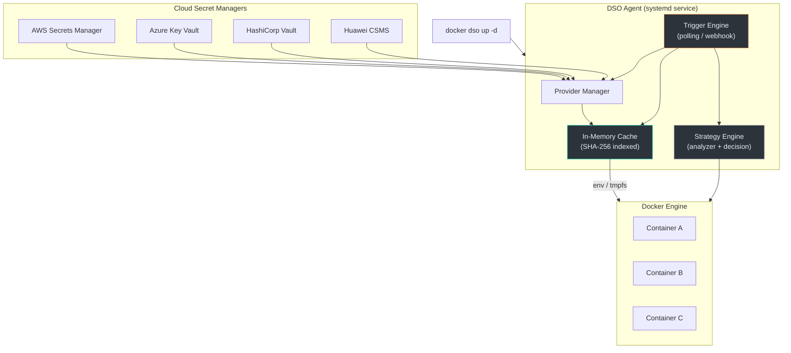
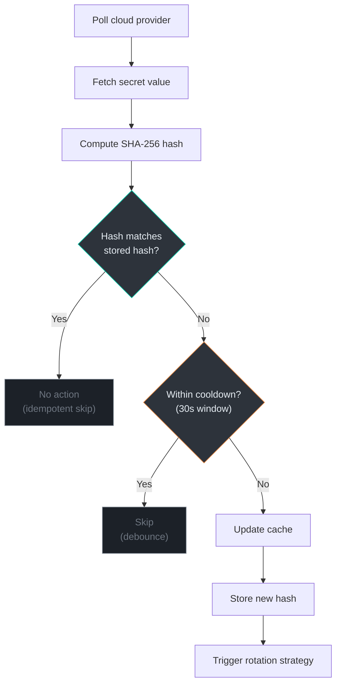
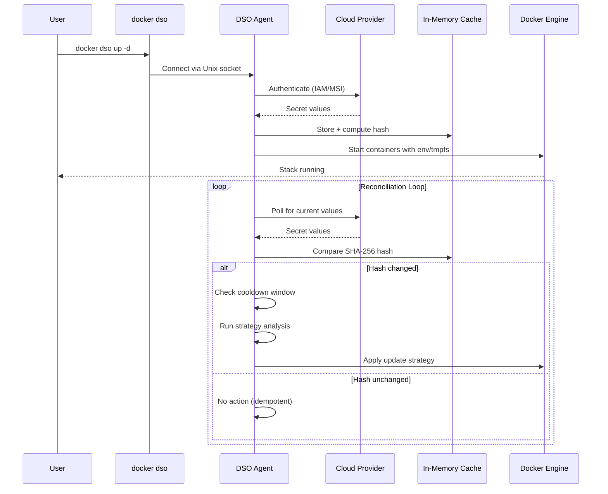

# Architecture

This document explains how DSO works under the hood. It's written for engineers who want to understand the system before contributing or extending it.

## Overview

DSO has four main parts:

1. **Provider System** — Fetches secrets from cloud backends (AWS, Azure, Vault, etc.)
2. **Agent** — A long-running daemon that caches secrets, serves requests, and runs the reconciliation loop
3. **Trigger Engine** — Detects when secrets change and decides what to do about it
4. **Reloader / Strategy Engine** — Determines the safest way to update a running container

Here's how they fit together:



---

## 1. Provider System

### How it works

Each cloud provider (AWS, Azure, Vault, Huawei) is implemented as a **separate binary** that communicates with the main agent over RPC.

We use [HashiCorp's go-plugin](https://github.com/hashicorp/go-plugin) framework for this. The key design choice: providers run as child processes, not as linked libraries. This means:

- A crash in the AWS provider doesn't crash the agent
- You can add a new provider without modifying the agent code
- Provider binaries can be updated independently

### The interface

Every provider implements one simple interface:

```go
type SecretProvider interface {
    Init(config map[string]string) error
    GetSecret(name string) (map[string]string, error)
    WatchSecret(name string, interval time.Duration) (<-chan SecretUpdate, error)
}
```

That's the entire contract. `Init` receives configuration from the YAML file, `GetSecret` does a one-time fetch, and `WatchSecret` sets up a polling channel.

### Plugin loading

When the agent needs a provider:

1. Checks if it's a built-in backend (`file` or `env`) — if so, uses it directly
2. Otherwise, looks for a binary named `dso-provider-<name>` in the plugin directory (`/usr/local/lib/dso/plugins/`)
3. Validates the binary path (must be absolute, in allowed directories, not a symlink, executable)
4. Launches it as a child process with a sanitized environment
5. Establishes an RPC connection using a handshake protocol
6. Caches the connection for reuse

If the binary fails to load, DSO retries with exponential backoff (3 attempts).

### Security measures

Plugin loading includes several hardening steps:
- Path validation (only allowed directories)
- Symlink rejection
- Sanitized process environment
- Magic cookie handshake to prevent accidental execution

---

## 2. Secret Injection Model

### Why tmpfs / in-memory?

The whole point of DSO is to keep secrets off disk. Here's how injection works:

**Environment variable injection:**
- DSO fetches secrets and stores them in the agent's process memory
- When a container starts via `docker dso up`, DSO passes the values as environment variables to Docker's API
- The values exist in the container's process environment but are never written to a file on the host

**File-based injection (tmpfs):**
- For containers that need secrets as files (e.g., TLS certificates), DSO writes them to `/var/run/dso/secrets/<name>/`
- This directory is on tmpfs — a RAM-based filesystem
- The write uses atomic rename (`write to .tmp` → `rename`) to prevent partial reads
- Files are created with restrictive permissions (`0400`)

### What this means in practice

- **No `.env` files** — Secrets don't sit on developer laptops or CI servers
- **No disk persistence** — If the machine shuts down, secrets are gone from the host
- **No git accidents** — There's nothing to accidentally commit

---

## 3. Trigger Engine (Reconciliation)

The trigger engine is the heart of DSO's reconciliation model. It continuously ensures that the secrets in your running containers match the current values in your cloud provider.

### How hash-based comparison works



Step by step:

1. The engine polls the provider at a configurable interval (e.g., every 30 seconds)
2. It fetches the current secret value
3. It computes a SHA-256 hash of the new value (`ComputeHash` function)
4. It compares this hash against the previously stored hash
5. **If identical** → Nothing happens. This is what makes the system idempotent. Polling 1000 times with the same value produces zero side effects.
6. **If different** → Checks the cooldown window (30 seconds by default). If a rotation already happened recently, it's skipped to prevent rapid-fire restarts.
7. **If the cooldown has passed** → The new hash is stored, the cache is updated, and the reloader is triggered.

### Adaptive polling

When nothing changes, the polling interval gradually increases (up to 4x the base interval). When a change is detected, it snaps back to the base interval. This reduces unnecessary API calls to your cloud provider.

### Trigger modes

DSO supports three trigger modes:

| Mode | How it works |
|------|-------------|
| **Polling** | Agent periodically fetches and compares. Simple and reliable. |
| **Webhook** | Your CI/CD or cloud provider sends an HTTP event to the agent. Lower latency. |
| **Hybrid** | Webhook for fast response, polling as a safety net. |

For webhooks, DSO uses timestamp-based idempotency keys to prevent duplicate processing.

---

## 4. Strategy Engine

When a secret change is detected, DSO needs to update the running containers. But not all containers can be updated the same way.

### The problem

- A container with a fixed host port (e.g., `80:80`) can't run two instances simultaneously — the port would collide
- A database container can't be blue/green swapped without risking data corruption
- A stateless web server can be seamlessly swapped with zero downtime

### How DSO handles this

The **Analyzer** inspects each container's metadata:

```
Container: mysql_database_cnt
- Fixed Port: YES (3306)
- Restart Policy: ALWAYS
- Stateful: YES (image contains "mysql")
- Health Check: NO
```

The **Decision Engine** scores each container on a 100-point scale:

| Condition | Score Impact |
|-----------|-------------|
| Fixed port binding | -50 |
| Explicit container name | -20 |
| `restart: always` policy | -20 |
| No health check | -10 |
| Stateful workload | -20 |

Based on the score:
- **≥ 70** → `rolling` (zero-downtime blue/green swap)
- **< 70** → `restart` (stop old, start new)

Containers can also be tagged with a specific strategy via Docker labels:
- `dso.update.strategy=signal` → Send SIGHUP (for apps that reload config on signal)
- `dso.update.strategy=restart` → Graceful restart
- `dso.update.strategy=auto` → Let the analyzer decide

### Rolling rotation in detail

When a rolling update is selected, here's the exact sequence:

1. Inspect the running container
2. Clone its configuration (image, env, volumes, networks, labels)
3. Rename the old container to a temporary name
4. Create a new container with the original name + updated secrets
5. Start the new container
6. Wait for it to pass health checks (configurable timeout)
7. **If healthy** → Stop and remove the old container. Done.
8. **If unhealthy** → Stop the new container, rename the old one back, resume. Automatic rollback.

This is the same blue/green pattern used by Kubernetes deployments, adapted for single Docker containers.

---

## 5. Overall Flow

From config to running containers, end to end:



---

## Directory structure

```
├── cmd/                    # CLI entry points (dso, dso-agent, providers)
├── internal/
│   ├── agent/              # Agent server, cache, trigger engine
│   ├── analyzer/           # Container metadata analysis
│   ├── audit/              # Structured audit logging
│   ├── cli/                # CLI command implementations
│   ├── core/               # Docker Compose integration
│   ├── injector/           # Secret injection into containers
│   ├── providers/          # Provider connection management
│   ├── rotation/           # Rolling strategy, health checks, cloning
│   ├── server/             # REST API and WebSocket event hub
│   ├── strategy/           # Decision engine (rolling vs restart)
│   └── watcher/            # Docker event loop, reloader controller
├── pkg/
│   ├── api/                # Shared interfaces and types
│   ├── backend/            # Built-in providers (file, env)
│   ├── config/             # YAML config parsing
│   ├── observability/      # Prometheus metrics, structured logging
│   └── provider/           # RPC plugin framework
├── plugin/                 # Docker CLI plugin metadata
├── schema/                 # JSON schema for dso.yaml
└── examples/               # Working examples for each provider
```
