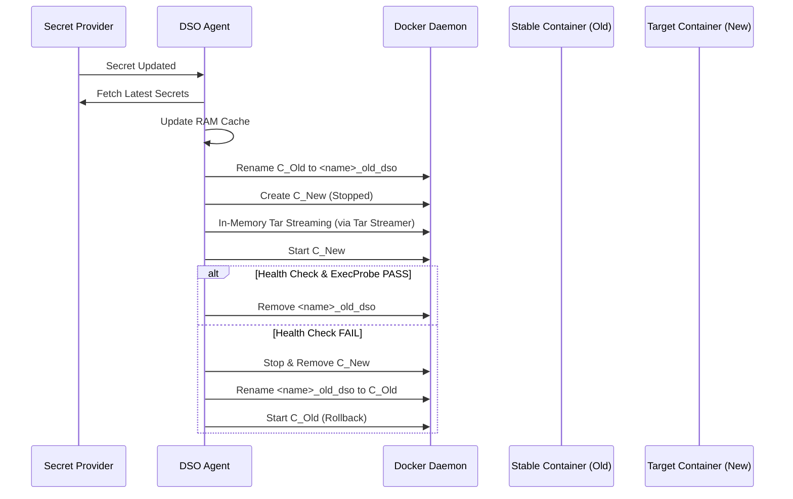
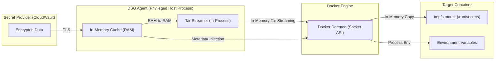

# DSO Architecture

## 1. System Overview
The Docker Secret Operator (DSO) is a reconciliation-based secret management engine for standalone Docker and Docker Compose environments. It implements a secure-by-default, zero-persistence model to ensure sensitive data is fetched from trusted providers and injected into containers without ever being written to the host's physical disk.

## 2. Core Components

### 2.1 DSO Agent
The primary long-running process that orchestrates the entire secret lifecycle. It handles authentication with providers, maintains the in-memory cache, and executes the core reconciliation loops.

### 2.2 Watcher Engine
An event-driven component that monitors:
- **Docker Socket**: Listens for container lifecycle events (start, die, stop).
- **Secret Providers**: Polls or receives webhooks from secret backends to detect updates.

### 2.3 Reloader Controller
Responsible for the atomic rotation of target containers. It manages the blue/green swap sequence, ensuring that a stable container is only replaced once the new version is verified as healthy and correctly injected. The Tar Streamer is a logical component within the Reloader Controller responsible for packaging secrets into an in-memory tar archive and securely injecting them into the target container via the Docker API.

### 2.4 Secret Providers
Pluggable backend connectors (Vault, AWS, Azure, Local) that implement the logic for authenticating and retrieving secret data in its native format.

### 2.5 In-Memory Cache
A volatile, non-persistent RAM storage facility. Secrets are cached to reduce latency and provider API load, but are wiped immediately upon agent termination.

---

## 3. End-to-End Secret Lifecycle
Note: The lifecycle stages described here map to internal controller operations but are abstracted for clarity and documentation purposes.

1. **Fetch**: The Agent retrieves secrets from the provider via TLS-encrypted connections.
2. **Cache**: Secrets are stored in RAM; hashes are computed to detect subsequent changes.
3. **Trigger**: Upon change detection, the Reloader Controller begins a transition.
4. **Rename**: The current running container is renamed to a backup name pattern: `<service_name>_old_dso`.
5. **Create**: A new container is created in a **stopped** state.
6. **Inject**: In-Memory Tar Streaming is performed by the Tar Streamer, sending secrets directly from the DSO Agent's RAM into the new container's `tmpfs` mounts via the Docker API.
7. **Start**: The new container is started.
8. **Validate**: Post-start `ExecProbes` verify that the secrets are correctly mounted and readable.
9. **Finalize**: If healthy, the `<service_name>_old_dso` container is removed; otherwise, a rollback is triggered.

---

## 4. Sequence Diagram (Rotation & Rollback)

---

## 5. Data Flow Diagram

---

## 6. Trust Boundaries

### 6.1 Host System (Trusted)
DSO assumes the underlying host machine and its physical RAM are trusted. If the host is compromised at the root level, the DSO process memory could be scraped.

### 6.2 Docker Daemon (Privileged Boundary)
DSO requires access to the Docker Socket (`/var/run/docker.sock`). This is a privileged boundary. DSO is designed to reside in this boundary to manage other containers safely.

### 6.3 Containers (Untrusted for Secret Exposure)
Target containers are considered untrusted environments where secrets can be leaked via logs or inspection. DSO mitigates this by:
- Using `tmpfs` to keep secrets out of persistent storage.
- Injecting secrets with `0400` permissions so only the owner can read them.
- Redacting secret data from DSO's own logs.

---

## 7. Secret Injection Flow

### 7.1 Tar Streaming via Docker API
DSO uses the `CopyToContainer` API to upload an in-memory `tar` stream. By constructing the archive in a RAM buffer, DSO ensures no plaintext secrets are ever written to the host filesystem during the transport process.

### 7.2 Injection Timing vs Start
Secrets are injected into containers **after** they are created but **before** they are started. This timing ensures that the application's entrypoint script—which often requires these secrets to initialize—has immediate access to the necessary data the moment the process begins.

---

## 8. Failure Handling

### 8.1 Injection Failure
If the In-Memory Tar Streaming process by the Tar Streamer fails, the container creation is aborted. The stable container remains running under its original name, and the error is logged with redaction.

### 8.2 Health Check Failure
If the new container starts but fails its Docker `HEALTHCHECK` or the DSO-specific `ExecProbe` (e.g., `test -s /run/secrets/key`), the system triggers an automatic rollback.

### 8.3 Rollback Failure (Degraded State)
DSO attempts rollout rollback up to 3 times with exponential backoff. If the rollback itself fails (e.g., due to Docker Engine issues), the service is marked as **Degraded**. No further automated rotations will be attempted for that service until manual intervention occurs, preventing a cascading failure loop.

---

## 9. Security Considerations

- **Zero-Persistence Model**: No secrets are written to host disk.
- **Volatile State**: All intermediate data exists in process RAM only.
- **Log Redaction**: Centralized filtering ensures that even if a developer enables `--debug`, secret values are never printed to the logs.
- **Least Privilege**: Injected files are owned by configurable `UID/GID` pairs with `0400` permissions in the `tmpfs` volume.
