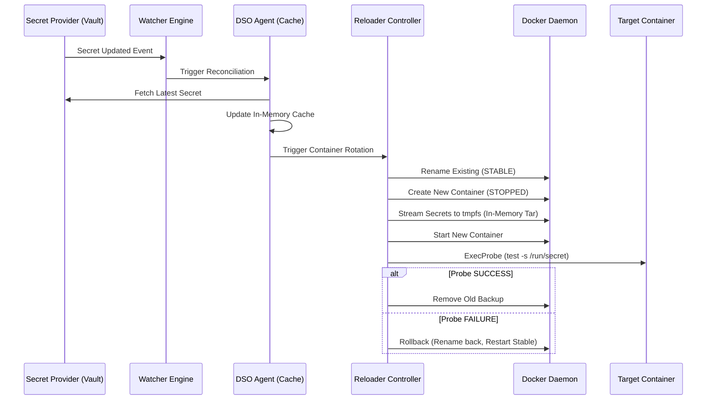

# DSO Architecture Overview

## 1. High-Level Components

DSO (Docker Secret Operator) consists of four primary subsystems:

1. **Secret Providers**: Plugins for HashiCorp Vault, AWS, Azure, and local dev environments.
2. **DSO Agent**: The core logic engine that manages secret fetching, caching, and rotation.
3. **Watcher Engine**: Monitors both the Docker Socket and secret providers for state changes.
4. **Reloader Controller**: Coordinates the container rotation lifecycle (Wait-Healthy, Recreate, Rollback).

## 2. Interaction Diagram (Secret Rotation)

## 3. Data Flow and Persistence
DSO is designed for **volatile, ephemeral state**:
- Secrets are metadata-defined in `dso.yaml` and labels.
- The `Agent` maintains an in-memory cache of secret values.
- **Zero-Disk Policy**: All intermediate data transfers (like the secret tarball) use Unix pipes or RAM buffers.

## 4. Lifecycle Strategies
DSO supports multiple operational strategies:
- **`rolling`**: Service-level rolling updates (for Compose deployments).
- **`restart`**: Atomic Blue/Green recreation at the individual container level.
- **`signal`**: Zero-recreation update using SIGHUP (compatible with Nginx, HAProxy).
