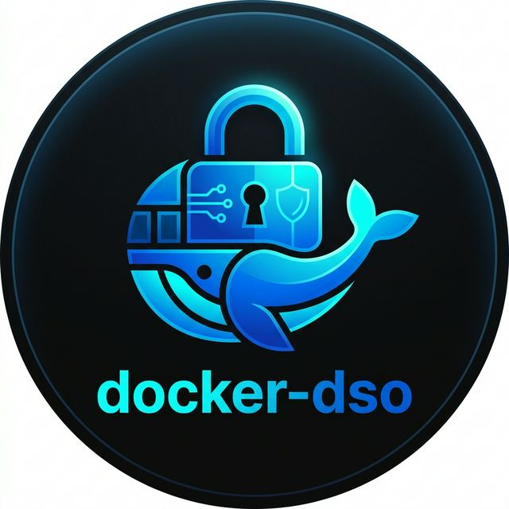

<div align="center">
  

  # Docker Secret Operator (DSO)

  **A reconciliation engine that syncs cloud secrets into Docker containers.**

  []()
  [](https://github.com/docker-secret-operator/dso/releases)
  [](LICENSE)

</div>

---

## What is DSO?

DSO is a lightweight agent that connects your Docker containers to cloud secret managers like AWS Secrets Manager, Azure Key Vault, and HashiCorp Vault.

It works like this: you define which secrets your containers need in a simple YAML file, and DSO fetches them at runtime and injects them directly into the container environment. No `.env` files on disk. No hardcoded credentials. The secrets stay in memory.

When a secret changes in your cloud provider, DSO detects the change automatically (using hash comparison), and updates the running containers — either by signaling them, restarting them, or performing a zero-downtime rolling swap. You don't have to do anything manually.

It runs as a native Docker CLI plugin, so the commands feel like regular Docker:

```bash
docker dso up -d
```

That's it. Your Compose stack is running with cloud secrets injected.

---

## Why does this exist?

Docker doesn't have a built-in way to manage secrets from cloud providers — unless you're using Docker Swarm (which most teams aren't) or you migrate everything to Kubernetes (which is often overkill for smaller stacks).

The result is that most Docker users end up with `.env` files sitting on disk, getting committed to git, shared over Slack, and silently failing compliance audits.

DSO was built to fix this specific gap. It brings the reconciliation pattern that Kubernetes uses for secret management — the idea of "desired state vs actual state, continuously reconciled" — to plain Docker and Docker Compose environments.

No cluster required. No Kubernetes. Just Docker.

---

## Quick Start

**1. Install**
```bash
curl -fsSL https://raw.githubusercontent.com/docker-secret-operator/dso/main/install.sh | sudo bash
```

**2. Configure (`/etc/dso/dso.yaml`)**
```yaml
provider: aws
secrets:
  - name: production-db-credentials
    inject: env
    mappings:
      DB_PASS: DB_PASS
```

**3. Run**
```bash
docker dso up -d
```

Your containers now have cloud secrets injected at runtime.

---

## How it works

When you run `docker dso up -d`, here's what happens:

1. **Reads config** — DSO parses your `docker-compose.yml` and `/etc/dso/dso.yaml`
2. **Authenticates** — Connects to your cloud vault using machine-level roles (IAM Instance Profiles, Managed Identity, etc.). No static keys.
3. **Fetches secrets** — Retrieves the values and holds them in memory only
4. **Injects** — Passes the secrets into the container's environment or mounts them via tmpfs
5. **Starts the stack** — Hands off to Docker Engine natively

After the stack is running, the reconciliation loop kicks in:

- Polls the cloud provider at a configurable interval
- Computes a SHA-256 hash of the current secret values
- Compares against the previously stored hash
- If there's a change → triggers the configured update strategy (signal, restart, or rolling swap)
- If nothing changed → does nothing (idempotent by design)

---

## Demo

### Deploying a Compose stack with secrets


### Automatic secret rotation


### Intelligent strategy selection


---

## Key design decisions

- **In-memory only** — Secrets are never written to disk. They live in the agent's process memory and are injected via environment variables or tmpfs mounts.
- **Plugin-based providers** — Each cloud provider (AWS, Azure, Vault, Huawei) runs as a separate binary, loaded via HashiCorp's go-plugin RPC framework. A crash in one provider doesn't take down the agent.
- **Hash-based reconciliation** — The trigger engine uses SHA-256 hashing to detect actual changes. Combined with a cooldown window, this prevents unnecessary restarts and ensures idempotent behavior.
- **Strategy engine** — Before rotating a container, DSO inspects its metadata (port bindings, statefulness, health checks) and automatically chooses the safest update strategy: rolling, restart, or signal.
- **Docker-native CLI** — Ships as a Docker CLI plugin. No wrapper scripts. Just `docker dso <cmd>`.

---

## Architecture

For a detailed walkthrough of the internals, see [ARCHITECTURE.md](ARCHITECTURE.md).

```
┌─────────────────┐     ┌──────────────┐     ┌──────────────────┐
│  Cloud Provider  │────▶│  DSO Agent   │────▶│  Docker Engine   │
│  (AWS/Azure/etc) │     │  (systemd)   │     │  (containers)    │
└─────────────────┘     └──────────────┘     └──────────────────┘
        ▲                      │
        │                      ▼
        │               ┌──────────────┐
        └───────────────│  Trigger     │
                        │  Engine      │
                        │  (reconcile) │
                        └──────────────┘
```

---

## Supported providers

| Provider | Status |
|----------|--------|
| AWS Secrets Manager | ✅ Stable |
| Azure Key Vault | ✅ Stable |
| HashiCorp Vault | ✅ Stable |
| Huawei Cloud CSMS | ✅ Stable |
| Local file / env | ✅ Built-in |

---

## Who uses this?

See [ADOPTERS.md](ADOPTERS.md) for a list of organizations using DSO in production.

---

## Contributing

Contributions are welcome. See [CONTRIBUTING.md](CONTRIBUTING.md) for how to get started.

---

## Security

To report a vulnerability, see [SECURITY.md](SECURITY.md).

---

## License

Apache License 2.0 — see [LICENSE](LICENSE).
