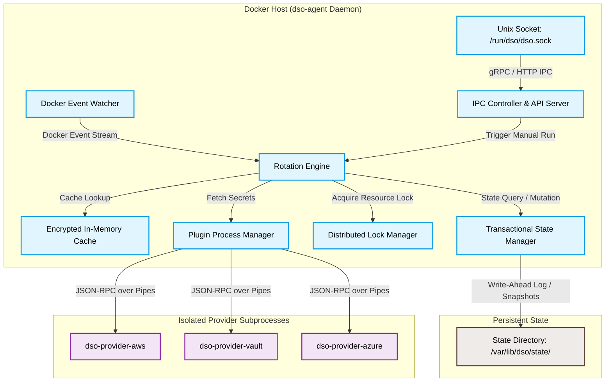
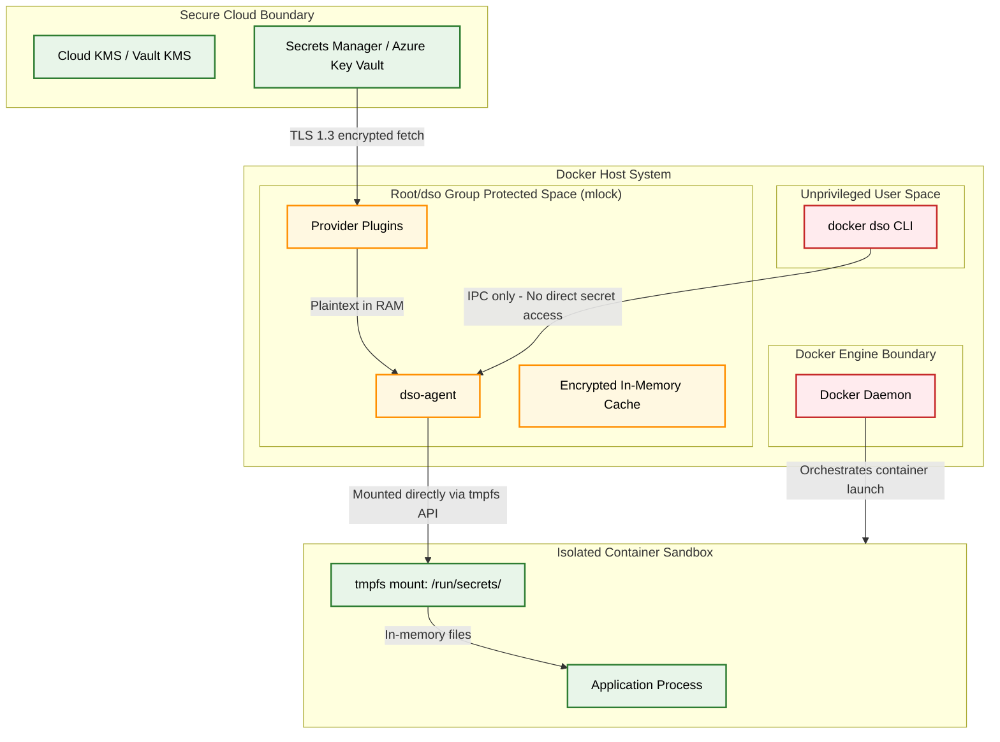
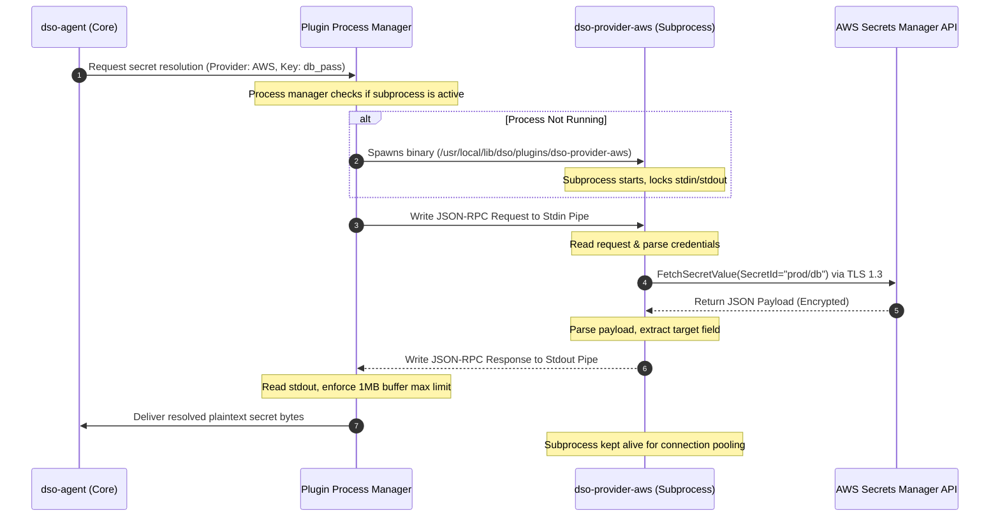
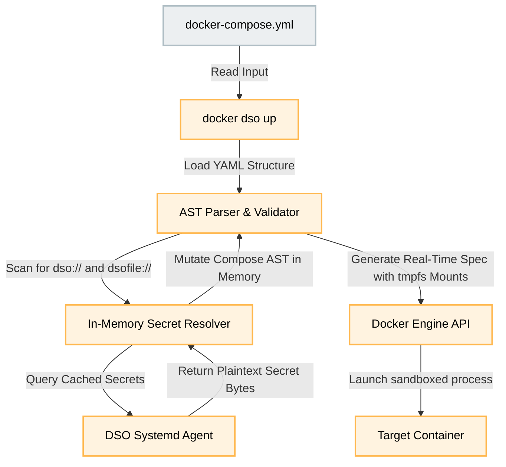
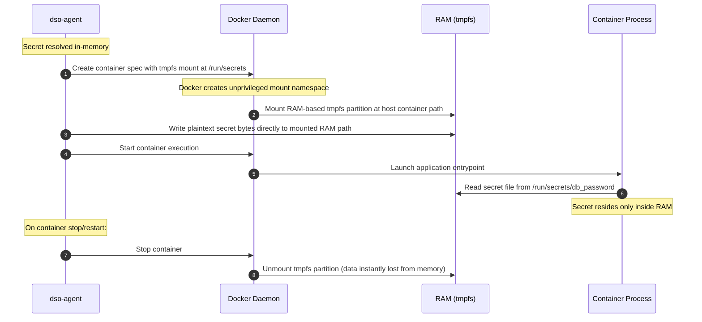
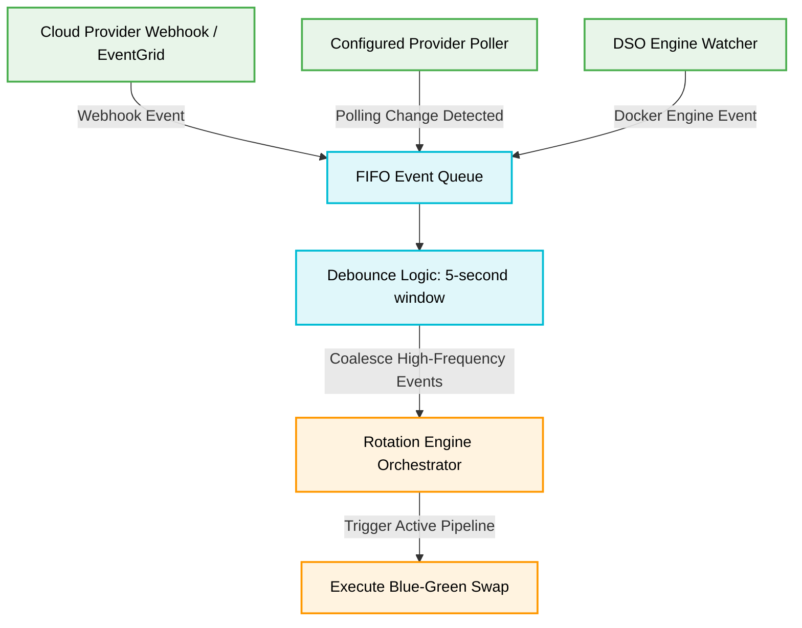
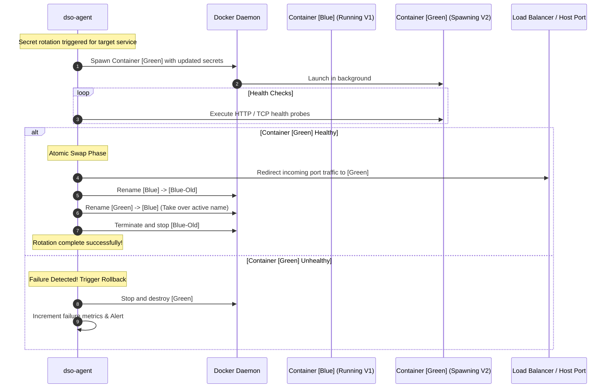
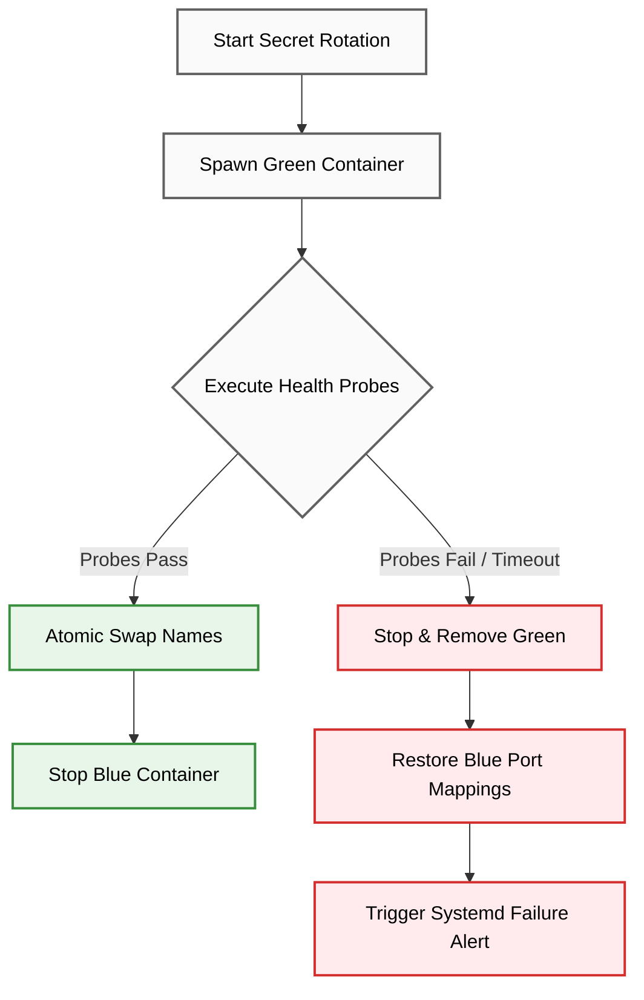
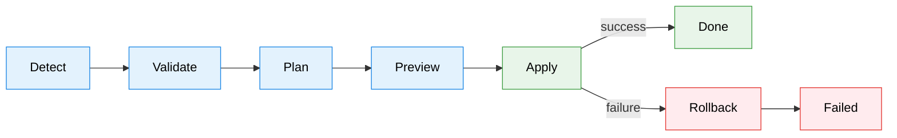

# DSO Architecture Guide (SRE & Security Reference)

This document provides a production-grade, SRE and security-focused analysis of the **Docker Secret Operator (DSO)**. It details the internal components, event-driven pipelines, security boundaries, and container lifecycles that govern DSO.

---

## 1. Internal DSO Agent Components

The `dso-agent` is a long-running, concurrent Go daemon designed to run alongside standard Docker engines. It is divided into decoupled, asynchronous event loops that coordinate via memory channels and transactional locks.



### Component Breakdown
* **IPC Controller & API Server**: Exposes a secure Unix Domain Socket (`/run/dso/dso.sock`) with strict `0660` permissions owned by `root:dso`. It handles commands from the `docker dso` CLI (such as status queries, manual rotations, and environment health checks).
* **Docker Event Watcher**: Listens directly to the Docker engine event stream, filtering for container start, stop, destroy, and edit events to automatically rebuild internal target maps of managed compose services.
* **Rotation Engine**: The core orchestrator. It manages the rotation queue, debounces high-frequency trigger events (5-second window), and executes transactional blue-green swaps.
* **Encrypted In-Memory Cache**: Temporarily holds plaintext secrets in memory using locked memory pages (`mlock`), preventing secret values from being written to swap space. High-performance cache TTLs avoid rate-limiting cloud provider APIs.
* **Transactional State Manager**: Manages write-ahead logging (WAL) and service mapping metadata in `/var/lib/dso/state/` to guarantee deterministic recovery after host crashes.

---

## 2. Security Boundaries & Isolation Model

DSO is designed around a zero-trust model regarding the host filesystem and the Docker metadata storage engine. It strictly isolates credentials across multiple execution layers.



### Key Security Controls
1. **No Disk Persistence for Secrets**: Under no circumstances are plaintext secret values written to physical host disks. They live exclusively in the `mlock`-guarded memory space of the agent and inside RAM-based `tmpfs` mounts.
2. **Docker Inspect Guard**: Traditional Docker secrets or environment variables injected via compose are visible via `docker inspect <container>`. DSO injects secrets at the process boundary (for environment variables) or via memory-mapped files (for file-based injection), ensuring `docker inspect` only reveals the dummy `dso://` or `dsofile://` reference URIs.
3. **IPC Unix Socket Isolation**: The communication channel `/run/dso/dso.sock` restricts access to root and members of the `dso` system group.

---

## 3. Provider Plugin Architecture

DSO isolates providers (AWS, Azure, HashiCorp Vault, Huawei Cloud) into distinct subprocesses. This ensures that provider SDK dependency vulnerabilities do not compromise the core DSO daemon.



### JSON-RPC IPC Schema
The core daemon communicates with the provider binaries using a structured, line-delimited JSON-RPC protocol over Unix Pipes (`stdin`/`stdout`).
* **Request Payload**:
  ```json
  {"jsonrpc":"2.0","method":"ResolveSecret","params":{"path":"myapp/db_password","config":{"region":"us-east-1"}},"id":1}
  ```
* **Response Payload**:
  ```json
  {"jsonrpc":"2.0","result":{"value":"s3cr3t_p4ssword"},"id":1}
  ```

---

## 4. Runtime Secret Injection & Compose Integration

DSO intercepts the normal `docker compose` execution flow. It acts as an Abstract Syntax Tree (AST) transformer for Compose YAML files, replacing `dso://` and `dsofile://` placeholders before they reach the Docker Engine.



### AST Modification Process
1. **Placeholder Parsing**: DSO parses the YAML file structure and identifies variables prefixed with `dso://` (for Environment variables) or `dsofile://` (for file-based mounts).
2. **Mount Modification**: For every `dsofile://myapp/cert` entry, DSO dynamically injects a temporary `tmpfs` volume mount into the service specification before submitting it to the Docker socket, allocating exactly the required memory size.

---

## 5. Tmpfs Secret Flow

File-based secrets are written to memory-mapped `/run/secrets/` directories, preventing any cryptographic artifacts from touching non-volatile storage.



---

## 6. Secret Rotation Lifecycle & Event Watcher Pipeline

DSO features a real-time event-driven rotation pipeline that monitors both Docker container lifecycles and Cloud Provider secret update triggers.



---

## 7. Blue-Green Container Replacement

When a secret rotation is triggered, DSO performs an in-place, zero-downtime blue-green container swap to avoid service disruptions.



---

## 8. Rollback and Recovery Workflows

If a newly spawned container fails its operational health checks during rotation, the transactional state manager performs an automatic, deterministic rollback to keep production services running.



---

## 9. Setup Engine Pipeline

`docker dso setup` is backed by a transactional setup engine in `internal/setup/`. It runs as a sequential, event-emitting pipeline with a clear separation of responsibilities across eight stages.



### Stage Responsibilities

| Stage | Package | Responsibility |
|-------|---------|---------------|
| **Detect** | `internal/setup` | Reads Docker socket, OS user, cloud provider metadata. Produces an immutable `Environment`. Never fails on missing optional data — absence is a fact. |
| **Validate** | `internal/setup` | Checks whether the detected environment can support the requested mode. Produces a frozen `ValidationResult`. Never re-reads the environment. |
| **Plan** | `internal/setup` | Generates an immutable `InstallPlan` from the environment and validation result. Declares file, directory, permission, service, and group operations. Never touches the OS. |
| **Preview** | `internal/setup` | Renders the plan to terminal or JSON. No side effects. |
| **Apply** | `internal/setup` | Executes the plan transactionally. Each operation is tracked in a `Transaction` with before/after snapshots for rollback. |
| **Rollback** | `internal/setup` | Triggered automatically on apply failure. Replays operations in reverse, restoring previous state from snapshots. |
| **Doctor** | `internal/setup` | Post-install diagnostic engine. Runs 17+ named checks across Docker, config, permissions, runtime, service, and provider categories. Produces a structured `DoctorResult`. |
| **Repair** | `internal/setup` | Consumes a `DoctorResult` and generates a `RepairPlan`. Executes safe actions automatically; prompts for confirmation on moderate or destructive actions. Runs Doctor again after repair to verify. |

### Design Principles

- **The engine never prints.** All output is emitted as typed `Event`s via a synchronous `Emitter`. The CLI subscribes and renders.
- **Each stage consumes only the previous stage's output.** Plan never inspects `Environment` directly; Doctor never re-discovers the environment.
- **All OS interactions are injectable.** Every executor struct holds function fields (`mkdir`, `writeFile`, `chmod`, `exec`) that are wired to real OS calls in production and replaced by no-ops in tests.
- **Panic-safe event delivery.** A panicking CLI listener cannot crash the engine; `Emitter.Emit` recovers from listener panics.

### Doctor Check Categories

| Category | Check IDs | What is verified |
|----------|-----------|-----------------|
| Docker | DSO-DOCTOR-001–003 | Binary exists, daemon reachable, socket permissions |
| Configuration | DSO-DOCTOR-006–009 | Config file exists, is valid YAML, has correct permissions |
| Provider | DSO-DOCTOR-010–011 | Provider recognized, credentials present |
| Runtime | DSO-DOCTOR-012–013 | Runtime directory exists, no stale lock files |
| Service | DSO-DOCTOR-014–017 | Systemd available, unit file present, service enabled and active |
| Permissions | DSO-DOCTOR-004–005 | Socket and config file ownership and mode |

---

## 10. SRE Operational Metrics & Health Signals

To monitor DSO health in production environments, track the following operational parameters using Prometheus or `docker dso status`:

| Metric Name | Type | Description | Alerting Threshold |
|---|---|---|---|
| `dso_rotation_success_total` | Counter | Total successful secret rotations | N/A (Diagnostic) |
| `dso_rotation_failures_total` | Counter | Total failed rotations (triggered rollback) | `> 0` (Warning) |
| `dso_provider_api_latency_seconds` | Histogram | Latency to cloud secret provider APIs | `> 2.5s` (Degraded Performance) |
| `dso_active_managed_containers` | Gauge | Total containers currently managed by DSO | N/A (Capacity Planning) |
| `dso_cache_hit_ratio` | Gauge | Ratio of cache hits vs total secret requests | `< 0.85` (API rate limit risk) |
