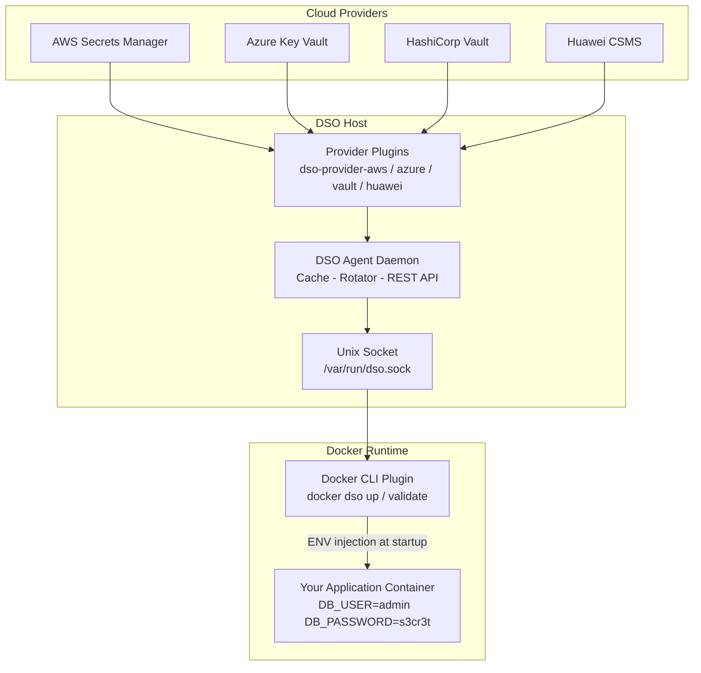
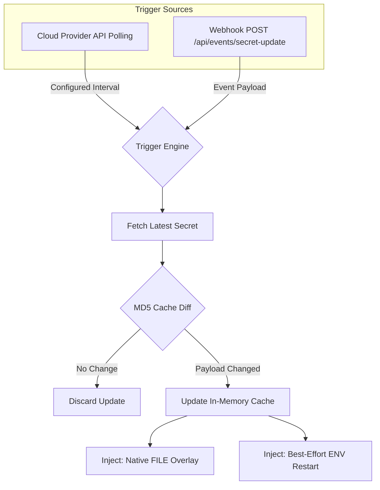

# Docker Secret Operator (DSO)

**Kubernetes-grade secret management for Docker and Docker Compose — no Kubernetes required.**

[](https://go.dev/)
[](https://github.com/docker-secret-operator/dso/releases)
[](https://github.com/docker-secret-operator/dso)
[](https://opensource.org/licenses/MIT)
[](https://github.com/docker-secret-operator/dso/stargazers)
[](https://github.com/docker-secret-operator/dso/actions)
[](https://docs.docker.com/engine/extend/)

---

**Docker Secret Operator (DSO)** is a lightweight, production-ready secret management layer for Docker and Docker Compose environments. It securely retrieves secrets from cloud secret managers — **AWS Secrets Manager**, **Azure Key Vault**, **Huawei CSMS**, **HashiCorp Vault** — and injects them into containers at runtime, without touching a single line of your `docker-compose.yaml`.

> No Kubernetes. No sidecar containers. No secrets in source control. Just a fast, secure, Docker-native secret agent.

**[Documentation Site →](https://umairmd385.github.io/docker-secret-operator/)**

---

## Table of Contents

- [Why This Project Exists](#why-this-project-exists)
- [Prerequisites](#prerequisites)
- [Quick Start](#quick-start)
- [Features](#features)
- [Architecture](#architecture)
- [Installation](#installation)
- [Configuration](#configuration)
- [Usage](#usage)
- [CLI Commands](#cli-commands)
- [Docker Compose Integration](#docker-compose-integration)
- [Real-World Use Case](#real-world-use-case)
- [Plugin System](#plugin-system)
- [Security Model](#security-model)
- [Examples](#examples)
- [Troubleshooting](#troubleshooting)
- [Project Structure](#project-structure)
- [Service Management](#service-management)
- [Roadmap](#roadmap)
- [Contributing](#contributing)
- [License](#license)

---

## Why This Project Exists

Most modern secret management tooling — External Secrets Operator, Sealed Secrets, Vault Agent Injector — is built exclusively for **Kubernetes**. But a huge portion of the industry still runs workloads on plain **Docker Compose**: startups, internal tools, staging environments, IoT, edge deployments.

DSO fills that gap:

| The Problem | The Solution |
| :--- | :--- |
| Secrets hardcoded in `docker-compose.yaml` | Inject secrets at runtime from a cloud provider |
| `.env` files committed to git | Central secret store, no local secret files |
| Kubernetes required for External Secrets | Works with any Docker or Docker Compose environment |
| Secrets visible in container environment dumps | Secrets sourced via secure Unix socket, never printed |
| Manual rotation after secret changes | Background polling with automatic cache refresh |

---

## Prerequisites

**Before running the installer**, create the DSO configuration file. This is required because the agent and Docker plugin both need it on first start.

```bash
sudo mkdir -p /etc/dso

sudo tee /etc/dso/dso.yaml > /dev/null << 'EOF'
provider: aws                  # Options: aws | azure | huawei | vault | file | env

config:
  region: us-east-1            # Your AWS region

secrets:
  - name: prod/database/creds  # Exact name from AWS Secrets Manager console
    inject: env
    mappings:
      username: DB_USER         # JSON key "username" → container ENV DB_USER
      password: DB_PASSWORD     # JSON key "password" → container ENV DB_PASSWORD
EOF

sudo chmod 600 /etc/dso/dso.yaml
```

> **Finding your secret name on AWS**: Open the AWS Console → Secrets Manager → click your secret → copy the **Secret name** field (e.g. `prod/database/creds`). Use that exact string in the `name:` field above.

---

## Quick Start

### Step 1 — Create configuration

Follow the [Prerequisites](#prerequisites) section above.

### Step 2 — Install DSO

```bash
curl -fsSL https://raw.githubusercontent.com/docker-secret-operator/dso/main/install.sh | sudo bash
```

During install you will be asked which cloud provider plugins to build. Press **Enter** to accept, type `n` to skip.

### Step 3 — Start the agent

```bash
sudo systemctl start dso
sudo systemctl status dso
```

### Step 4 — Deploy your application

```bash
docker dso up -d
```

That's it. DSO reads `/etc/dso/dso.yaml`, fetches your secrets from the cloud, and injects them into your containers before they start.

---

## Features

| Feature | Description |
| :--- | :--- |
| **No Kubernetes Required** | Works natively with Docker and Docker Compose. |
| **Multi-Cloud Support** | AWS Secrets Manager, Azure Key Vault, Huawei CSMS, HashiCorp Vault. |
| **Local Backends** | `file` and `env` backends for local development or air-gapped use. |
| **Runtime Secret Injection** | Secrets are fetched and injected at container startup — never written to disk. |
| **Background Secret Rotation** | Agent polls cloud providers and refreshes in-memory cache automatically. |
| **Native Docker CLI Plugin** | Seamlessly integrates with the `docker` command for a native UX. |
| **Unix Socket IPC** | CLI communicates with the agent over a secure Unix domain socket. |
| **Prometheus Metrics** | Track fetch counts, latencies, and backend failures at `:9090/metrics`. |
| **REST Admin API** | Health checks and cache inspection at `:8080/health` and `/secrets`. |
| **Structured Logging** | High-performance `zap` logging with automatic secret redaction. |
| **Plugin Architecture** | Write a custom provider plugin for any secret backend in Go. |
| **One-Command Install** | Automated installer handles everything end-to-end. |

---

## Architecture

DSO has two main components: the **DSO Agent** that runs as a systemd service, and the **Docker CLI Plugin** (`docker-dso`) that provides the primary interface.



### How Secrets Flow

1. **`DSO Agent` starts** as a systemd service, loads provider plugins, and begins polling the configured cloud provider on a set interval, caching results in memory.
2. **You run `docker dso up -d`** — the Docker CLI plugin connects to the agent over the Unix socket (`/var/run/dso.sock`), retrieves the mapped secret values, and overlays them onto the process environment.
3. **`docker compose`** is then executed internally by the plugin with the enriched environment. Containers see the resolved env vars (`DB_PASSWORD=s3cr3t`) as if they were set locally — because they are, in-memory, for that process only.
4. **For Docker Swarm**, DSO implements the V2 Secret Driver API and the `docker dso` command.

---

## Installation

### Automated (Recommended)

```bash
curl -fsSL https://raw.githubusercontent.com/docker-secret-operator/dso/main/install.sh | sudo bash
```

**What the installer does:**

| Step | Action |
| :---: | :--- |
| 1 | Checks OS compatibility (Ubuntu/Debian) |
| 2 | Installs missing dependencies (`curl`, `git`, Docker) |
| 3 | Installs Go 1.22+ if not present or too old |
| 4 | Clones the repository to `/tmp/dso-install` |
| 5 | Builds core binaries (`docker-dso`, `DSO Agent`) |
| 6 | Asks which provider plugins to build (interactive) |
| 7 | Creates `/etc/dso/dso.yaml` if missing (interactive) |
| 8 | Configures and enables the `DSO Agent` systemd service |
| 9 | Optionally creates the Docker V2 Secret Plugin |
| 10 | Verifies the installation |

> **Requirements**: Ubuntu 20.04+ / Debian 11+, root/sudo access, internet connection.

### Manual Build

```bash
git clone https://github.com/docker-secret-operator/dso.git
cd docker-secret-operator

# Build the Docker CLI Plugin (Single Binary)
# The binary acts as both the plugin and the agent.
CGO_ENABLED=0 go build -ldflags="-s -w" -o /usr/local/lib/docker/cli-plugins/docker-dso ./cmd/docker-dso/

# Build only the plugins you need
mkdir -p /usr/local/lib/dso/plugins
CGO_ENABLED=0 go build -ldflags="-s -w" -o /usr/local/lib/dso/plugins/dso-provider-aws    ./cmd/plugins/dso-provider-aws/
CGO_ENABLED=0 go build -ldflags="-s -w" -o /usr/local/lib/dso/plugins/dso-provider-azure  ./cmd/plugins/dso-provider-azure/
CGO_ENABLED=0 go build -ldflags="-s -w" -o /usr/local/lib/dso/plugins/dso-provider-huawei ./cmd/plugins/dso-provider-huawei/
CGO_ENABLED=0 go build -ldflags="-s -w" -o /usr/local/lib/dso/plugins/dso-provider-vault  ./cmd/plugins/dso-provider-vault/
```

### Uninstall

```bash
curl -fsSL https://raw.githubusercontent.com/docker-secret-operator/dso/main/scripts/uninstall.sh | sudo bash
```

---

## Configuration

DSO is configured via `/etc/dso/dso.yaml`. The agent reads this file on startup and the Docker CLI plugin auto-discovers it.

### Full Configuration Reference

```yaml
# ── Provider ──────────────────────────────────────────────────────────────────
# Which secret backend to use.
# Options: aws | azure | huawei | vault | file | env
provider: aws

# ── Provider Config ───────────────────────────────────────────────────────────
# Provider-specific connection parameters.
config:
  region: us-east-1      # AWS: region
                         # Azure: vault_name
                         # Vault: address (http://...) + token + mount

# ── Secret Mappings ───────────────────────────────────────────────────────────
# Each entry fetches one secret and maps its JSON keys to container ENV vars.
secrets:
  - name: prod/database/credentials   # Secret name in the cloud provider
    inject: env                       # Injection mode: env | file
    mappings:
      username: DB_USER               # JSON key → ENV variable name
      password: DB_PASSWORD
      host:     DB_HOST

  - name: prod/stripe/api
    inject: env
    mappings:
      api_key: STRIPE_API_KEY
```

### Provider Configuration Examples

**AWS Secrets Manager**

```yaml
provider: aws
config:
  region: us-east-1
```

> Authentication: IAM Role (EC2 Instance Profile), `~/.aws/credentials`, or `AWS_ACCESS_KEY_ID` / `AWS_SECRET_ACCESS_KEY` environment variables.

**Azure Key Vault**

```yaml
provider: azure
config:
  vault_url: "https://your-vault-name.vault.azure.net/"  # Full URL from Azure Portal → Key Vault → Overview
```

> Authentication: Azure Managed Identity (recommended for Azure VMs), Service Principal (`AZURE_TENANT_ID`, `AZURE_CLIENT_ID`, `AZURE_CLIENT_SECRET`), or `az login`.

> **Azure mapping note**: Azure secrets are plain strings, not JSON. DSO wraps them as `{"value": "..."}`. Use `value` as the mapping key in all Azure secrets.

**HashiCorp Vault**

```yaml
provider: vault
config:
  address: http://127.0.0.1:8200
  token: hvs.your_token_here
  mount: secret
```

**Huawei Cloud CSMS**

```yaml
provider: huawei
config:
  region: ap-southeast-2             # Your Huawei Cloud region
  project_id: your-project-id       # IAM → My Credentials → Project ID
  access_key: ""                    # Leave empty when using IAM Agency on ECS
  secret_key: ""                    # Leave empty when using IAM Agency on ECS
```

> **Huawei ECS authentication**: Attach an IAM Agency with `CSMS FullAccess` + `KMS Administrator` to your ECS instance, then run the metadata credential script — see [examples/huawei-compose/README.md](examples/huawei-compose/README.md).

**Local File (Development)**

```yaml
provider: file
config:
  path: /etc/dso/secrets/
```

Place files like `/etc/dso/secrets/database.json` with contents `{"password": "dev-pass"}`.

---

### Run from any directory

After installation, the `docker dso` command works from **any directory** on your system. It automatically loads `/etc/dso/dso.yaml`:

```bash
# From your project directory — no need to have dso.yaml locally
cd ~/projects/my-app
docker dso up -d
```

To use a local config instead:

```bash
docker dso --config ./dso.yaml up -d
```

### Verify the agent is running

```bash
sudo systemctl status dso
journalctl -u DSO Agent -f
```

### Fetch a secret manually

```bash
docker dso fetch prod/database/credentials
```

---

## CLI Commands

| Command | Description |
| :--- | :--- |
| `docker dso up` | Fetch secrets and run `docker compose up` |
| `docker dso up -d` | Fetch secrets and run in detached mode |
| `docker dso down` | Stop and remove DSO-managed containers |
| `docker dso validate` | Verify configuration and provider connectivity |
| `docker dso --config ./path up` | Use a custom config file |

---

## Docker Compose Integration

`docker dso` is a **transparent, Docker-native wrapper** around `docker compose`. It:

1. Reads your `/etc/dso/dso.yaml`
2. Connects to `DSO Agent` via the Unix socket
3. Fetches the required secrets from the cloud provider
4. Overlays the secret values onto the current environment
5. Calls `docker compose` with the enriched environment

**`docker-compose.yaml`** — declare the env var names:

```yaml
version: "3.9"
services:
  api:
    image: my-api:latest
    environment:
      - DB_USER       # Injected by DSO from cloud provider
      - DB_PASSWORD   # Injected by DSO from cloud provider
      - DB_HOST       # Injected by DSO from cloud provider

  worker:
    image: my-worker:latest
    environment:
      - STRIPE_API_KEY  # Injected by DSO
```

**`/etc/dso/dso.yaml`** — map cloud secrets to those names:

```yaml
provider: aws
config:
  region: us-east-1
secrets:
  - name: prod/database/credentials
    inject: env
    mappings:
      username: DB_USER
      password: DB_PASSWORD
      host:     DB_HOST
  - name: prod/stripe/api
    inject: env
    mappings:
      api_key: STRIPE_API_KEY
```

**Deploy:**

```bash
docker dso up -d
```

**Verify injection:**

```bash
docker compose exec api printenv | grep DB_
# DB_USER=admin
# DB_PASSWORD=s3cr3t
# DB_HOST=rds.example.com
```

---

## Real-World Use Case

**Scenario**: A Node.js API server and a background worker, deployed with Docker Compose on an EC2 instance, needing database credentials and a Stripe API key from AWS Secrets Manager.

**Without DSO:**

```yaml
# docker-compose.yaml — secrets hardcoded or in a committed .env file
environment:
  - DB_PASSWORD=mySuperSecretPass   # ← dangerous: in git history
```

**With DSO:**

```yaml
# docker-compose.yaml — no secrets here
environment:
  - DB_PASSWORD   # ← resolved at runtime by DSO Agent from AWS
```

```bash
# On the EC2 instance — IAM Role attached, no credentials needed locally
docker dso up -d
```

Benefits:
- No secrets in source control or on disk
- Rotate secrets in AWS → containers pick them up on next restart
- Audit trail in AWS CloudTrail, not in shell history
- Same approach works for staging and production with different IAM roles

---

## Plugin System

DSO uses a [go-plugin](https://github.com/hashicorp/go-plugin) RPC architecture. The agent launches provider binaries as child processes and communicates via RPC over a Unix socket.

### Built-in Plugins

| Provider | Binary | Status |
| :--- | :--- | :--- |
| AWS Secrets Manager | `dso-provider-aws` | Stable |
| Azure Key Vault | `dso-provider-azure` | Stable |
| Huawei Cloud CSMS | `dso-provider-huawei` | Stable |
| HashiCorp Vault (KV v2) | `dso-provider-vault` | Stable |

### Native Backends (no binary needed)

| Backend | `provider:` value | Use case |
| :--- | :--- | :--- |
| Local JSON files | `file` | Development, CI/CD |
| Environment variables | `env` | Forwarding host env vars |

### Writing a Custom Provider

Implement the `SecretProvider` interface from `pkg/api/`:

```go
type SecretProvider interface {
    Init(config map[string]string) error
    GetSecret(name string) (map[string]string, error)
    WatchSecret(name string, interval time.Duration) (<-chan SecretUpdate, error)
}
```

Then serve it using `hashicorp/go-plugin`:

```go
func main() {
    plugin.Serve(&plugin.ServeConfig{
        HandshakeConfig: provider.Handshake,
        Plugins: map[string]plugin.Plugin{
            "provider": &provider.SecretProviderPlugin{Impl: &MyProvider{}},
        },
    })
}
```

Build and place the binary in `/usr/local/lib/dso/plugins/dso-provider-myprovider`, then set `provider: myprovider` in your `dso.yaml`.

---

## Real-Time Event Streaming (WebSockets)

DSO exposes a live WebSocket feed to trace dynamic internal agent triggers, rendering heavy HTTP polling on `/api/events` obsolete for rich-client integrations.

**Endpoint**: `ws://localhost:8080/api/events/ws`

### Key Features
- **Real-Time Push**: Emits strict JSON structures natively defining `restart_started`, `injection_failed`, and `health_check_passed` boundaries.
- **Backwards Compatibility**: Traditional clients can retain standard polling natively calling `GET /api/events`.
- **Catch-up Sync**: The WebSocket handshake immediately flushes recently cached events instantly syncing offline boundaries seamlessly via query limits (`?limit=50`).
- **Filtering**: Drop unnecessary telemetry natively utilizing query params directly (`?severity=error`).

### Example Integration

```javascript
const socket = new WebSocket('ws://localhost:8080/api/events/ws?limit=50');

socket.onmessage = function(event) {
  const data = JSON.parse(event.data);
  console.log(`[${data.timestamp}] ${data.secret} mapped to ${data.container}: ${data.status}`);
};
```

---

## Event-Driven Trigger Engine (Automatic Secret Rotation)

### Overview
DSO natively supports continuous Automatic Secret Rotation leveraging a powerful hybrid **Trigger Engine**. You can operate securely in pure polling mode, pure webhook (event-driven) mode, or a robust hybrid fallback model.

### How It Works



- **Hybrid Event-Driven Architecture**: The Trigger Engine exposes `POST /api/events/secret-update` securely tracking Idempotency and Authorization limits directly triggering secret pipelines without expensive polling operations. 
- **Detects changes**: The agent calculates MD5 checksums validating if remote secret payloads differ from active memory cache safely natively explicitly ignoring duplicate Webhook streams exactly natively natively compactly accurately. 
- **Updates cache**: Once rotated, the unified memory cache explicitly drops the old metadata.
- **Re-injects into containers**: Live containers mapping the modified secrets are mapped dynamically based on their injection type.

### Integration Guides (Webhooks)
To wire DSO directly to your cloud seamlessly reducing polling costs completely:
- **AWS Secrets Manager**: Connect **AWS EventBridge** explicitly mapping `SecretUpdate` rules structurally targeting an AWS Lambda seamlessly hitting the DSO `/api/events/secret-update` securely. 
- **Azure Key Vault**: Configure **Azure Event Grid** safely subscribing directly accurately to the Key Vault intuitively correctly targeting the exact API intelligently appropriately proactively. 

### Best-Effort Rolling Restart Strategy
Ensuring services face minimal network degradation during a credentials rollover is paramount.
- **Best-Effort Rolling Restart for ENV-based Injection**: Environment-bound secrets require container reconstruction. DSO automates this by cloning the existing container topology, waiting for native Docker health check probes to pass gracefully on the temp container, and subsequently dropping traffic from the old footprint silently. Fallbacks are correctly utilized returning to the old container gracefully natively.
- **Graceful Shutdown**: Target container configurations support mapping graceful kill-windows.

### Configuration Example
You can manage the rotation strictly seamlessly inside `dso.yaml`:
```yaml
agent:
  watch:
    mode: hybrid # polling, event, hybrid
    polling_interval: 15m
  webhook:
    enabled: true
    auth_token: "super-secure-string"
  auto_sync: true

restart_strategy:
  type: rolling
  grace_period: 20s

secrets:
  - name: my_database_password
    inject: env
    rotation: true
```

### Injection Behavior
- **ENV**: Imposes a complete rolling restart natively managed with fallback bounding capabilities.
- **FILE**: Triggers a live payload file replacement mapped instantly via temporary overlays (no restart required).

### Example Workflow
1. A database secret is manually rotated inside AWS Secrets Manager.
2. DSO detects the MD5 diff variation natively within the defined polling parameters.
3. The Agent unified cache is wiped and appended with the new token dynamically.
4. Temporary container `workload-temp` spins up successfully mapping the new payload.
5. The container reports valid Docker Health checks. Workload swaps occur natively with no disruptions.

---

## Limitations

- **Polling Computing Costs**: Aggressive polling intervals (e.g., `< 1m`) will consume significant API request quotas against your cloud provider and could incur severe execution cost penalties depending on provider billing rules. Active adaptive polling helps mediate this, but fundamental quotas apply natively.
- **Docker Restart Constraints**: The best-effort rolling restart system attempts health checks safely, but does not guarantee pure zero-downtime execution in high-traffic or poorly orchestrated external routing meshes. Expect minor dropped network packets dynamically on intensive layers.
- **File Injection Dependencies**: Injecting securely utilizing `.file` modes strictly depends on your internal application's behavior. If your application logic does not natively watch for file modifications to trigger scoped internal reloads, configurations will remain stagnant despite the file overwriting successfully under the hood natively.

## Recommended Usage

- **Injection Preferences**: For true safety limits, **use file-based injection** (`inject: file`) instead of environment variables (`inject: env`). Binding variables inherently exposes secret payloads permanently explicitly bridging to `docker inspect`, permanently undermining fundamental isolation boundaries natively.
- **Polling Intervals**: Opt for longer polling limits (e.g., `refresh_interval: 5m` to `15m`) gracefully balancing active cluster freshness securely prioritizing cloud quota limits robustly natively.
- **Health Checks**: If utilizing best-effort rolling restarts natively under `inject: env`, strictly implement robust formal Docker `HEALTHCHECK` definitions statically inside your container definitions ensuring DSO safely aborts topology updates protecting workloads implicitly from panic crashes during reconstruction spans exclusively.

---

### Limitations
- Inherently relies on polling-based detection mechanisms mapping to cloud provider API rate limits.
- Depends strictly on explicit container health definitions (Docker Compose `healthcheck`) to orchestrate swaps safely.

---

## Security Model

| Control | Implementation |
| :--- | :--- |
| **Secrets never written to disk** | All secret values are held in the agent's in-memory cache only. |
| **In-memory injection** | Secrets are injected into the `docker compose` process environment, never stored in files. |
| **tmpfs file injection** | When `inject: file` is used, secrets are written to a memory-backed tmpfs mount, not a persistent filesystem. |
| **Unix socket access control** | The agent socket (`/var/run/dso.sock`) is protected by OS-level file permissions. Only the DSO process and its user can access it. |
| **Log redaction** | `zap` structured logging is configured to never include secret values. Only secret names and metadata are logged. |
| **IAM Roles / Managed Identity** | On AWS/Azure/Huawei, use Instance Profiles or Managed Identities. DSO never needs long-lived credentials. |
| **Plugin binary isolation** | Each provider runs as an isolated child process. A crashing plugin cannot bring down the main agent. |

---

## Examples

Ready-to-use reference configurations are in the `examples/` directory:

| Example | Cloud Provider | Guide |
| :--- | :--- | :--- |
| `examples/aws-compose/` | AWS Secrets Manager | [README →](examples/aws-compose/README.md) |
| `examples/azure-compose/` | Azure Key Vault | [README →](examples/azure-compose/README.md) |
| `examples/huawei-compose/` | Huawei Cloud CSMS | [README →](examples/huawei-compose/README.md) |

### Docker Swarm Example

```bash
# Step 1: Create a secret using the DSO driver
docker dso secret create -d dso-secret-driver db_password "prod/database/credentials"

# Step 2: Deploy the stack
docker stack deploy -c docker-compose.yaml my-app
```

---

## Troubleshooting

### Plugin Not Found

```
Error: failed to start provider plugin client dso-provider-aws
```

The plugin binary is missing or not executable.

```bash
ls -la /usr/local/lib/dso/plugins/
chmod +x /usr/local/lib/dso/plugins/dso-provider-aws

# Check the provider name in your dso.yaml matches exactly:
grep provider /etc/dso/dso.yaml
```

---

### Authentication Failure

```
StatusCode: 403 Forbidden
```

The host lacks valid cloud provider credentials.

```bash
# AWS — verify IAM identity
aws sts get-caller-identity
# Check EC2 Instance Profile:
curl -s http://169.254.169.254/latest/meta-data/iam/info

# Azure — verify login
az account show
az keyvault secret list --vault-name your-vault

# Huawei — re-fetch credentials from ECS metadata service
CREDS=$(curl -s http://169.254.169.254/openstack/latest/securitykey)
sudo tee /etc/dso/agent.env > /dev/null << EOF
HUAWEI_ACCESS_KEY=$(echo $CREDS | python3 -c "import sys,json; print(json.load(sys.stdin)['credential']['access'])")
HUAWEI_SECRET_KEY=$(echo $CREDS | python3 -c "import sys,json; print(json.load(sys.stdin)['credential']['secret'])")
HUAWEI_SECURITY_TOKEN=$(echo $CREDS | python3 -c "import sys,json; print(json.load(sys.stdin)['credential']['securitytoken'])")
EOF
sudo systemctl restart DSO Agent
```

---

### Huawei CSMS.0401 — KMS Decryption Failed

```
huawei csms GetSecret: error_code: CSMS.0401
```

The IAM Agency is missing the `KMS Administrator` permission. Go to **IAM → Agencies → your agency → Permissions → Authorize** and add `KMS Administrator` alongside `CSMS FullAccess`. Both are required.

---

### Secret Mapping Errors

```
Error: key "password" not found in secret "my-secret"
```

The JSON key in your `mappings:` block doesn't match the actual key stored in the provider.

```bash
# Inspect the actual secret structure on AWS:
aws secretsmanager get-secret-val### Config File Not Found

```bash
# Verify the config exists
ls -la /etc/dso/dso.yaml

# Re-create if missing
sudo mkdir -p /etc/dso
sudo tee /etc/dso/dso.yaml > /dev/null << 'EOF'
provider: aws
config:
  region: us-east-1
secrets:
  - name: my-secret
    inject: env
    mappings:
      password: DB_PASSWORD
EOF
sudo chmod 600 /etc/dso/dso.yaml
sudo systemctl restart DSO Agent
```

---

## Project Structure

```
docker-secret-operator/
├── cmd/
│   ├── docker-dso/                # CLI entrypoint (docker dso up, docker dso agent)
│   └── plugins/
│       └── dso-provider-vault/    # HashiCorp Vault plugin
│
├── internal/
│   ├── agent/                     # Core agent (cache, socket server, rotator)
│   ├── analyzer/                  # Container analysis for rotation strategies
│   ├── audit/                     # Audit logging
│   ├── cli/                       # Command implementations (up, down, watch, etc.)
│   ├── core/                      # Main orchestration logic
│   ├── injector/                  # Secret injection client
│   ├── providers/                 # Secret provider manager
│   ├── rotation/                  # Rotation strategy implementations
│   ├── server/                    # RPC server for agent communication
│   └── watcher/                   # Docker event monitoring
│
├── pkg/
│   ├── api/                       # Shared API interfaces
│   ├── config/                    # Config loading and validation
│   └── observability/             # Logging and metrics
│
├── plugin/
│   └── config.json                # Docker V2 Secret Driver manifest
│
├── examples/                      # Deployment examples
├── .github/workflows/             # CI/CD pipelines
├── scripts/
│   ├── install.sh                 # Linux/macOS/WSL installer
│   └── install.ps1                # Windows powershell installer
└── README.md                      # Main documentation
```

---
---

## Service Management

| Action | Command |
| :--- | :--- |
| **Start** | `sudo systemctl start dso` |
| **Stop** | `sudo systemctl stop DSO Agent` |
| **Restart** | `sudo systemctl restart DSO Agent` |
| **Enable on boot** | `sudo systemctl enable DSO Agent` |
| **View live logs** | `journalctl -u DSO Agent -f` |
| **Health check** | `curl http://localhost:8080/health` |
| **List cached secrets** | `curl http://localhost:8080/secrets` |
| **Prometheus metrics** | `curl http://localhost:9090/metrics` |

---

## Roadmap

### v1.1 — In Progress
- Secret rotation delivery via `inject: file` (tmpfs hot-reload)
- CLI improvements (`dso status`, `dso validate`)
- `--dry-run` mode to preview injected values

### v1.2 — Planned
- Secret TTL per mapping
- Webhook notifications on rotation
- Support for multiple providers simultaneously

### v2.0 — Future
- Web UI for secret inspection
- Secret access policy engine
- Kubernetes compatibility layer (CRD-based config)
- Secret diff history and audit log viewer

---

## Contributing

Contributions are welcome! Please open an Issue before submitting a Pull Request to discuss the change.

```bash
# Fork and clone
git clone https://github.com/your-username/docker-secret-operator.git
cd docker-secret-operator

# Create a feature branch
git checkout -b feat/my-feature

# Make your changes and run tests
go test ./...

# Submit
git commit -m "feat: describe your change"
git push origin feat/my-feature
# Open a Pull Request on GitHub
```

All PRs are automatically verified by GitHub Actions: lint (`golangci-lint`), tests, and security scanning (Gosec + Trivy).

---

## License

DSO is licensed under the [MIT License](LICENSE).

---

## Documentation

Full documentation is available at:

**[https://umairmd385.github.io/docker-secret-operator/](https://umairmd385.github.io/docker-secret-operator/)**

