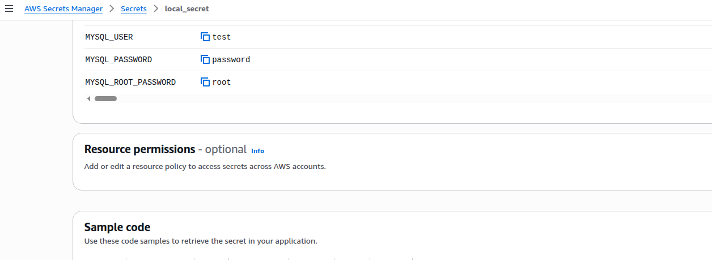
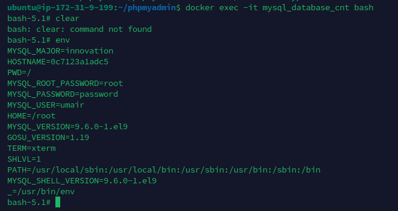

# AWS Secrets Manager + MySQL + phpMyAdmin

This example demonstrates using **Docker Secret Operator (DSO)** to inject MySQL credentials from **AWS Secrets Manager** into a MySQL + phpMyAdmin stack running on an EC2 instance — with zero secrets in your compose file or shell.

---

## What This Example Does

| Component | Role |
| :--- | :--- |
| **AWS Secrets Manager** | Stores `MYSQL_ROOT_PASSWORD`, `MYSQL_USER`, `MYSQL_PASSWORD` |
| **DSO Agent** | Fetches the secret from AWS and caches it in memory |
| **docker dso** | Injects the secret values into docker compose at startup |
| **mysql_db** | MySQL container receives credentials via environment variables |
| **phpmyadmin** | phpMyAdmin connects to MySQL without needing credentials in the compose file |

---

## Prerequisites

- DSO installed (`curl -fsSL .../install.sh | sudo bash`)
- EC2 instance with an **IAM Role** that has `secretsmanager:GetSecretValue` permission
- A secret created in **AWS Secrets Manager** (see Step 1 below)

---

## Step 1 — Create the Secret in AWS Secrets Manager

Go to **AWS Console → Secrets Manager → Store a new secret**.

Choose **Other type of secret** and add the following key/value pairs:

| Key | Example Value |
| :--- | :--- |
| `MYSQL_ROOT_PASSWORD` | `root` |
| `MYSQL_USER` | `umair` |
| `MYSQL_PASSWORD` | `password` |

Give the secret a name — in this example: **`local_secret`**.



> The secret name (`local_secret`) is what you will reference in `dso.yaml`. The keys (`MYSQL_ROOT_PASSWORD`, etc.) are the JSON field names that DSO maps to container environment variables.

---

## Step 2 — Configure DSO

Copy the provided `dso.yaml` to `/etc/dso/dso.yaml`:

```bash
sudo mkdir -p /etc/dso
sudo cp dso.yaml /etc/dso/dso.yaml
sudo chmod 600 /etc/dso/dso.yaml
```

**`dso.yaml`** — connects to AWS and maps secret keys to ENV vars:

```yaml
# DSO Example: AWS Secrets Manager (V3.2)
providers:
  aws-prod:
    type: aws
    region: us-east-2    # Change to your AWS region

defaults:
  inject:
    type: env
  rotation:
    enabled: true
    strategy: restart

secrets:
  - name: arn:aws:secretsmanager:REGION:ACCOUNT:secret:YOUR_SECRET_NAME
    provider: aws-prod
    mappings:
      MYSQL_ROOT_PASSWORD: MYSQL_ROOT_PASSWORD
      MYSQL_USER: MYSQL_USER
      MYSQL_PASSWORD: MYSQL_PASSWORD
```

> **IAM Authentication**: On EC2, DSO automatically uses the **Instance Profile** (IAM Role) — no access keys needed. Ensure your EC2 role has `secretsmanager:GetSecretValue` for the secret ARN.

---

## Step 3 — Start the DSO Agent

```bash
sudo systemctl start dso-agent
sudo systemctl status dso-agent

# Confirm it can reach your secret:
docker dso fetch local_secret
```

Expected output:

```
Secret: local_secret
  MYSQL_ROOT_PASSWORD: root
  MYSQL_USER: umair
  MYSQL_PASSWORD: password
```

---

## Step 4 — Review the Docker Compose File

**`docker-compose.yaml`** — notice there are **no secret values** here:

```yaml
version: "3.9"

services:
  mysql_db:
    container_name: mysql_database_cnt
    image: mysql:latest
    ports:
      - "3306:3306"
    environment:
      - MYSQL_ROOT_PASSWORD   # ← DSO injects this from AWS
      - MYSQL_USER            # ← DSO injects this from AWS
      - MYSQL_PASSWORD        # ← DSO injects this from AWS
    restart: always
    volumes:
      - ./mysql-data:/var/lib/mysql

  phpmyadmin:
    container_name: phpmyadmin_cnt
    image: phpmyadmin/phpmyadmin:latest
    restart: always
    ports:
      - "82:80"
    environment:
      PMA_HOST: mysql_db
      PMA_PORT: 3306
```

---

## Step 5 — Deploy

```bash
# From the examples/aws-compose directory
docker dso up -d
```

**Expected output:**
```text
DSO matched config: /etc/dso/dso.yaml
DSO securely injecting secrets for docker-compose.yaml...
[+] up 3/3
 ✔ Network mysql_default        Created                                                                                                                                                                                                  0.1s
 ✔ Container phpmyadmin_cnt     Started                                                                                                                                                                                                  0.8s
 ✔ Container mysql_database_cnt Started 
```

DSO will:
1. Load `/etc/dso/dso.yaml`
2. Connect to `DSO Agent` over the Unix socket
3. Fetch `MYSQL_ROOT_PASSWORD`, `MYSQL_USER`, `MYSQL_PASSWORD` from `local_secret`
4. Inject them into the environment
5. Run `docker compose up -d` with the enriched environment

---

## Step 6 — Verify the Secrets Were Injected

Connect to the running MySQL container and inspect the environment:

```bash
docker exec -it mysql_database_cnt bash
env | grep MYSQL_
```

**Expected output** showing secrets injected from AWS:

```
MYSQL_ROOT_PASSWORD=root
MYSQL_PASSWORD=password
MYSQL_USER=umair
```



> Notice that the container received the exact values from AWS Secrets Manager — without those values ever appearing in `docker-compose.yaml`, `.env` files, or shell history.

---

## Step 7 — Access phpMyAdmin

Open your browser at `http://<EC2-PUBLIC-IP>:82`

Login with:
- **Server**: `mysql_db`
- **Username**: `umair` (from `MYSQL_USER`)
- **Password**: `password` (from `MYSQL_PASSWORD`)

---

## How Authentication Works on EC2

DSO uses the **AWS SDK default credential chain** — no manual configuration needed on EC2:

```
1. Environment variables (AWS_ACCESS_KEY_ID / AWS_SECRET_ACCESS_KEY)
2. ~/.aws/credentials file
3. EC2 Instance Profile (IAM Role) ← recommended for EC2
4. ECS/EKS task role
```

The recommended setup is:

1. Create an IAM Role with this policy:

```json
{
  "Version": "2012-10-17",
  "Statement": [
    {
      "Effect": "Allow",
      "Action": "secretsmanager:GetSecretValue",
      "Resource": "arn:aws:secretsmanager:us-east-2:YOUR_ACCOUNT_ID:secret:local_secret-*"
    }
  ]
}
```

2. Attach the IAM Role to your EC2 instance:
   - **EC2 Console → Instance → Actions → Security → Modify IAM role**

3. DSO will automatically use the role — no credentials on disk.

---

## File Structure

```
examples/aws-compose/
├── docker-compose.yaml     # MySQL + phpMyAdmin stack (no hardcoded secrets)
├── dso.yaml                # DSO config pointing to AWS Secrets Manager
├── screenshots/
│   ├── aws-secret-values.png        # AWS Console showing secret keys
│   └── container-env-verification.png  # Container env showing injected values
└── README.md               # This guide
```

---

## Cleanup

```bash
docker dso down
# or
docker compose down -v  # also removes volumes
```
