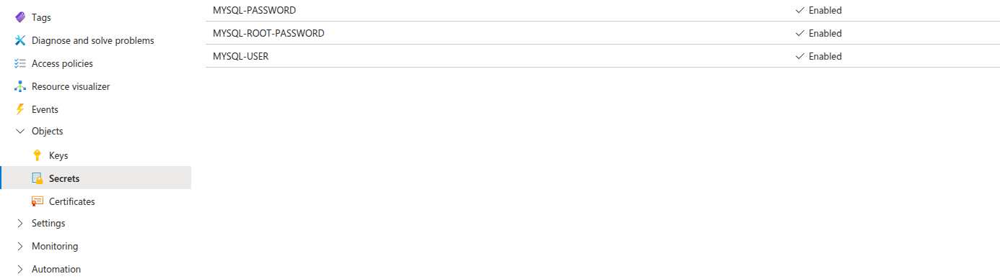
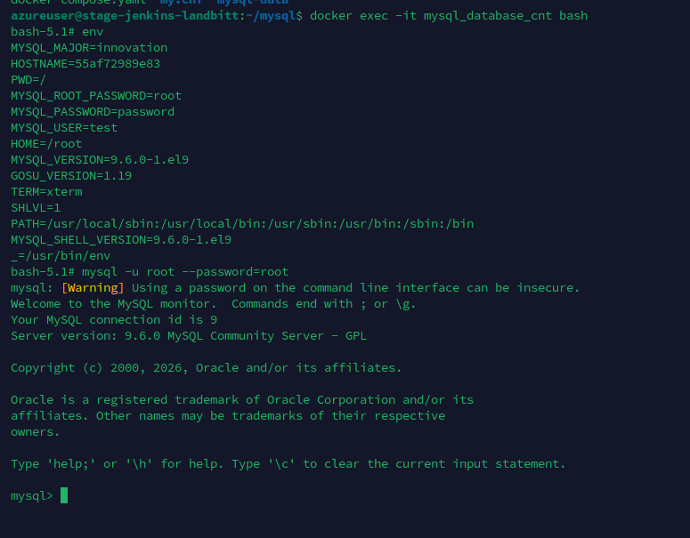

# Azure Key Vault + MySQL + phpMyAdmin

This example demonstrates using **Docker Secret Operator (DSO)** to inject MySQL credentials from **Azure Key Vault** into a MySQL + phpMyAdmin stack — with zero secrets in your compose file or on disk.

---

## What This Example Does

| Component | Role |
| :--- | :--- |
| **Azure Key Vault** | Stores `MYSQL-ROOT-PASSWORD`, `MYSQL-USER`, `MYSQL-PASSWORD` as individual secrets |
| **dso-agent** | Authenticates to Azure, fetches secrets, and caches them in memory |
| **dso compose** | Injects the secret values into docker compose at container startup |
| **mysql_db** | MySQL container receives credentials via environment variables |
| **phpmyadmin** | Connects to MySQL without any credentials in the compose file |

---

## Prerequisites

- DSO installed (`curl -fsSL .../install.sh | sudo bash`)
- An **Azure Key Vault** with the three secrets created (see Step 1)
- One of the following for authentication:
  - **Azure VM with a Managed Identity** assigned (recommended — no credentials on disk)
  - **Service Principal** with `Key Vault Secrets User` role

---

## Azure vs AWS — Key Difference in DSO Config

> **Important**: Azure Key Vault stores secrets as **plain strings**, not JSON objects like AWS Secrets Manager.
>
> DSO wraps each Azure string value as `{"value": "<secret-string>"}` internally.
> This means the mapping key is **always `value`**, regardless of the secret name.

| Provider | Secret format | DSO mapping key |
| :--- | :--- | :--- |
| AWS Secrets Manager | JSON object `{"password": "s3cr3t"}` | The JSON field name (e.g. `password`) |
| **Azure Key Vault** | Plain string `"s3cr3t"` | Always `value` |

---

## Step 1 — Create Secrets in Azure Key Vault

In the **Azure Portal → Key Vault → Secrets**, create three secrets:

| Secret Name | Example Value | Description |
| :--- | :--- | :--- |
| `MYSQL-ROOT-PASSWORD` | `root` | MySQL root user password |
| `MYSQL-USER` | `test` | Application MySQL username |
| `MYSQL-PASSWORD` | `password` | Application MySQL user password |

> **Note**: Azure Key Vault does not allow underscores (`_`) in secret names. DSO automatically converts `_` to `-` when fetching, so you can use either naming style in `dso.yaml`.

The secrets in your Key Vault should look like this — all showing **Enabled** status:



---

## Step 2 — Set Up Authentication

### Option A: Managed Identity (Recommended for Azure VMs)

1. In the Azure Portal, go to your VM → **Identity → System assigned → On → Save**
2. In Key Vault → **Access policies → Add Access Policy**:
   - **Secret permissions**: `Get`, `List`
   - **Select principal**: your VM's name
3. Save. Done — no credentials needed on the VM.

### Option B: Service Principal

```bash
# Set environment variables for the Azure provider
export AZURE_TENANT_ID="your-tenant-id"
export AZURE_CLIENT_ID="your-client-id"
export AZURE_CLIENT_SECRET="your-client-secret"

# Or use az login for interactive authentication
az login
```

---

## Step 3 — Configure DSO

Copy `dso.yaml` to the system config location:

```bash
sudo mkdir -p /etc/dso
sudo cp dso.yaml /etc/dso/dso.yaml
sudo chmod 600 /etc/dso/dso.yaml
```

**`dso.yaml`** — connects to your Azure Key Vault and maps each secret:

```yaml
provider: azure

config:
  vault_url: "https://dev-kv.vault.azure.net/"   # Your Key Vault URL

agent:
  cache: true
  refresh_interval: 5s

secrets:
  - name: MYSQL-ROOT-PASSWORD    # Exact name in Azure Key Vault
    inject: env
    mappings:
      value: MYSQL_ROOT_PASSWORD  # Azure strings always use "value" as the key

  - name: MYSQL-USER
    inject: env
    mappings:
      value: MYSQL_USER

  - name: MYSQL-PASSWORD
    inject: env
    mappings:
      value: MYSQL_PASSWORD
```

> **Finding your vault URL**: Azure Portal → Key Vault → **Overview** → copy the **Vault URI** (e.g. `https://dev-kv.vault.azure.net/`)

---

## Step 4 — Start the DSO Agent

```bash
sudo systemctl restart dso-agent
sudo systemctl status dso-agent

# Verify each secret is reachable:
dso fetch MYSQL-ROOT-PASSWORD
dso fetch MYSQL-USER
dso fetch MYSQL-PASSWORD
```

Expected output for each:

```
Secret: MYSQL-ROOT-PASSWORD
  value: root
```

---

## Step 5 — Review the Docker Compose File

**`docker-compose.yaml`** — no secrets here:

```yaml
services:
  mysql_db:
    container_name: mysql_database_cnt
    image: mysql:latest
    ports:
      - "3306:3306"
    environment:
      - MYSQL_ROOT_PASSWORD    # ← Injected by DSO from Azure Key Vault
      - MYSQL_USER             # ← Injected by DSO from Azure Key Vault
      - MYSQL_PASSWORD         # ← Injected by DSO from Azure Key Vault
    restart: always
    volumes:
      - $PWD/mysql-data:/var/lib/mysql

  phpmyadmin:
    container_name: phpmyadmin_cnt
    image: phpmyadmin/phpmyadmin:latest
    restart: always
    ports:
      - "82:80"
    environment:
      PMA_HOST: mysql_db
      PMA_PORT: 3306
```

---

## Step 6 — Deploy

```bash
dso compose up -d
```

DSO will:
1. Load `/etc/dso/dso.yaml`
2. Connect to `dso-agent` over the Unix socket
3. Fetch `MYSQL-ROOT-PASSWORD`, `MYSQL-USER`, `MYSQL-PASSWORD` from Azure Key Vault
4. Inject them into the environment as `MYSQL_ROOT_PASSWORD`, `MYSQL_USER`, `MYSQL_PASSWORD`
5. Run `docker compose up -d` with the enriched environment

---

## Step 7 — Verify the Secrets Were Injected

```bash
docker exec -it mysql_database_cnt bash
env | grep MYSQL_
```

**Expected output** — credentials injected from Azure Key Vault:

```
MYSQL_ROOT_PASSWORD=root
MYSQL_PASSWORD=password
MYSQL_USER=test
```

You can also verify by logging in to MySQL directly:

```bash
mysql -u root --password=root
```



---

## Step 8 — Access phpMyAdmin

Open your browser at `http://<YOUR-VM-IP>:82`

Login with:
- **Server**: `mysql_db`
- **Username**: `test` (from `MYSQL-USER`)
- **Password**: `password` (from `MYSQL-PASSWORD`)

---

## Troubleshooting

### Authentication failed / 401 Unauthorized

```bash
# Check your Azure login
az account show

# Verify the Managed Identity can access the vault
az keyvault secret show \
  --vault-name dev-kv \
  --name MYSQL-ROOT-PASSWORD
```

### Secret name not found

Azure secret names are **case-sensitive** and **hyphen-only** (no underscores). Verify the exact name:

```bash
az keyvault secret list --vault-name dev-kv --query "[].name" -o table
```

Ensure the name in `dso.yaml` matches exactly.

### `dso fetch` shows empty value

Azure secrets must be in **Enabled** status. Check in the Azure Portal → Key Vault → Secrets → confirm each secret shows ✓ Enabled.

---

## File Structure

```
examples/azure-compose/
├── docker-compose.yaml     # MySQL + phpMyAdmin (no hardcoded secrets)
├── dso.yaml                # DSO config pointing to Azure Key Vault
├── screenshots/
│   ├── azure-keyvault-secrets.png      # Azure Portal showing the 3 secrets
│   └── container-env-verification.png # Container env + MySQL login proof
└── README.md               # This guide
```

---

## Cleanup

```bash
dso compose down
# or to also remove volumes:
docker compose down -v
```
