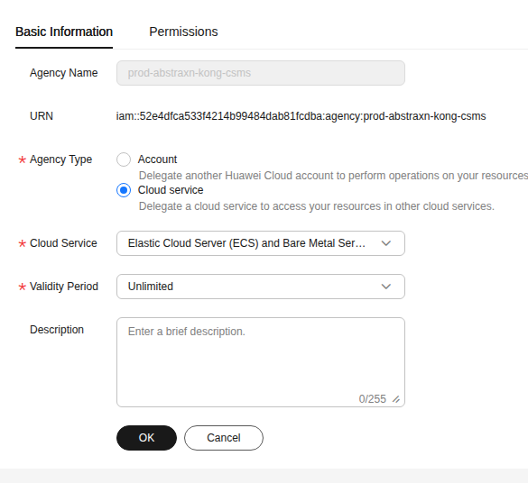
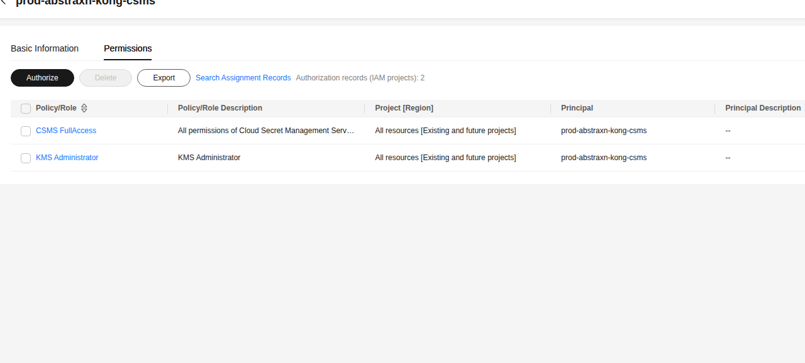
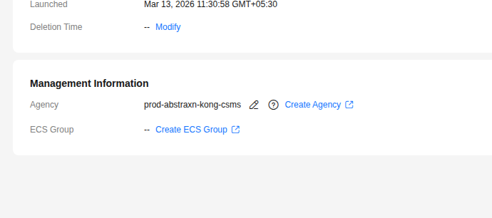

# Huawei Cloud CSMS + MySQL + phpMyAdmin

This example demonstrates using **Docker Secret Operator (DSO)** to inject MySQL credentials from **Huawei Cloud Secret Management Service (CSMS)** into a MySQL + phpMyAdmin stack — with zero secrets in your compose file or on disk.

Authentication uses **IAM Agency** on the ECS instance — no long-term access keys required.

---

## What This Example Does

| Component | Role |
| :--- | :--- |
| **Huawei CSMS** | Stores MySQL credentials as a JSON secret |
| **IAM Agency** | Grants the ECS instance permission to read CSMS and KMS resources |
| **DSO Agent** | Reads temporary credentials from ECS metadata, fetches secrets from CSMS |
| **docker dso** | Injects secret values into docker compose at container startup |
| **mysql_db** | MySQL container receives credentials via environment variables |
| **phpmyadmin** | Connects to MySQL without any credentials in the compose file |

---

## Prerequisites

- DSO installed (`curl -fsSL .../install.sh | sudo bash`)
- A **Huawei Cloud ECS** instance in region `ap-southeast-2`
- A **CSMS secret** created with your MySQL credentials (see Step 1)
- An **IAM Agency** with `CSMS FullAccess` and `KMS Administrator` attached to the ECS (see Steps 2–4)

---

## Step 1 — Create the Secret in Huawei CSMS

In the **Huawei Console → Cloud Secret Management Service → Secrets**, create a new secret.

- **Secret type**: Other
- **Secret name**: `localhost-sm` (use your own name)
- **Secret value**: JSON format with your MySQL credentials

```json
{
  "MYSQL_ROOT_PASSWORD": "root",
  "MYSQL_USER": "admin",
  "MYSQL_USER_PASSWORD": "password"
}
```

> **Important**: DSO maps the JSON field names to container ENV variables. The keys in `mappings:` in `dso.yaml` must match the JSON field names exactly (case-sensitive).

---

## Step 2 — Create an IAM Agency

Go to **Huawei Console → IAM → Agencies → Create Agency**.

In the **Basic Information** tab, fill in:

| Field | Value |
| :--- | :--- |
| **Agency Name** | `prod-abstraxn-kong-csms` (or any name you choose) |
| **Agency Type** | Cloud service |
| **Cloud Service** | Elastic Cloud Server (ECS) and Bare Metal Server |
| **Validity Period** | Unlimited |



Click **OK** to create.

---

## Step 3 — Add Permissions to the Agency

After creating the agency, go to the **Permissions** tab and click **Authorize**.

Add the following two policies:

| Policy | Scope | Why Required |
| :--- | :--- | :--- |
| **CSMS FullAccess** | All resources | Allows reading secret values from CSMS |
| **KMS Administrator** | All resources | Allows decrypting secret values encrypted by KMS |

> **Important**: Without `KMS Administrator`, you will get error `CSMS.0401` — "Secret value decryption through KMS service failed." Both policies are required.



---

## Step 4 — Attach the Agency to Your ECS Instance

Go to **Huawei Console → ECS → Your Instance → Management Information**.

Click the **pencil icon** next to **Agency** and select the agency you just created (`prod-abstraxn-kong-csms`).



After attaching, the ECS instance can now obtain temporary credentials automatically from the metadata service without any long-term access keys.

---

## Step 5 — Fetch Temporary Credentials and Configure DSO

On your Huawei ECS instance, run the following to fetch temporary credentials from the metadata service and write them to the DSO agent environment file:

```bash
# Fetch temporary credentials from ECS metadata service
CREDS=$(curl -s http://169.254.169.254/openstack/latest/securitykey)

sudo tee /etc/dso/agent.env > /dev/null << EOF
HUAWEI_ACCESS_KEY=$(echo $CREDS | python3 -c "import sys,json; print(json.load(sys.stdin)['credential']['access'])")
HUAWEI_SECRET_KEY=$(echo $CREDS | python3 -c "import sys,json; print(json.load(sys.stdin)['credential']['secret'])")
HUAWEI_SECURITY_TOKEN=$(echo $CREDS | python3 -c "import sys,json; print(json.load(sys.stdin)['credential']['securitytoken'])")
EOF

sudo chmod 600 /etc/dso/agent.env
```

> **Why this step is needed**: The `DSO Agent` runs as a systemd service and does not inherit your shell environment. The credentials must be explicitly placed in `/etc/dso/agent.env` which the systemd unit reads as `EnvironmentFile`.

---

## Step 6 — Configure DSO

Copy the provided `dso.yaml` to the system config location:

```bash
sudo mkdir -p /etc/dso
sudo cp dso.yaml /etc/dso/dso.yaml
sudo chmod 600 /etc/dso/dso.yaml
```

**`dso.yaml`** — connects to Huawei CSMS and maps the secret JSON fields to container ENV vars:

```yaml
# DSO Example: Huawei Cloud CSMS (V3.1)
providers:
  huawei-prod:
    type: huawei
    region: ap-southeast-2
    project_id: 98176f42176505f83584d83fd6baedf   # Your project ID

defaults:
  inject:
    type: env

secrets:
  - name: localhost-sm              # Exact CSMS secret name
    provider: huawei-prod
    mappings:
      MYSQL_ROOT_PASSWORD: MYSQL_ROOT_PASSWORD   # JSON key → container ENV
      MYSQL_USER: MYSQL_USER
      MYSQL_USER_PASSWORD: MYSQL_PASSWORD        # JSON key → different ENV name
```

> **Finding your project_id**: Huawei Console → top-right menu → **My Credentials** → Project ID for your region.

---

## Step 7 — Start the DSO Agent

```bash
sudo systemctl restart DSO Agent
sudo systemctl status DSO Agent

# Verify the secret is reachable
docker dso fetch localhost-sm
```

Expected output:

```
Secret: localhost-sm
  MYSQL_ROOT_PASSWORD: root
  MYSQL_USER: admin
  MYSQL_USER_PASSWORD: password
```

---

## Step 8 — Review the Docker Compose File

**`docker-compose.yaml`** — no secrets anywhere in this file:

```yaml
services:
  mysql_db:
    container_name: mysql_database_cnt
    image: mysql:latest
    ports:
      - "3306:3306"
    environment:
      - MYSQL_ROOT_PASSWORD   # ← Injected from Huawei CSMS by DSO
      - MYSQL_USER            # ← Injected from Huawei CSMS by DSO
      - MYSQL_PASSWORD        # ← Injected from Huawei CSMS by DSO
    restart: always
    volumes:
      - $PWD/mysql-data:/var/lib/mysql

  phpmyadmin:
    container_name: phpmyadmin_cnt
    image: phpmyadmin/phpmyadmin:latest
    restart: always
    ports:
      - "82:80"
    environment:
      PMA_HOST: mysql_db
      PMA_PORT: 3306
```

---

## Step 9 — Deploy

```bash
docker dso up -d
```

DSO will:
1. Load `/etc/dso/dso.yaml`
2. Use `HUAWEI_ACCESS_KEY`, `HUAWEI_SECRET_KEY`, `HUAWEI_SECURITY_TOKEN` from `/etc/dso/agent.env`
3. Fetch `localhost-sm` from Huawei CSMS in `ap-southeast-2`
4. Map `MYSQL_ROOT_PASSWORD`, `MYSQL_USER`, `MYSQL_USER_PASSWORD` to the container ENV vars
5. Run `docker compose up -d` with the injected environment

---

## Step 10 — Verify the Secrets Were Injected

```bash
docker exec -it mysql_database_cnt bash
env | grep MYSQL_
```

Expected output:

```
MYSQL_ROOT_PASSWORD=root
MYSQL_USER=admin
MYSQL_PASSWORD=password
```

---

## Step 11 — Access phpMyAdmin

Open your browser at `http://<ECS-PUBLIC-IP>:82`

Login with:
- **Server**: `mysql_db`
- **Username**: the value of `MYSQL_USER` from CSMS
- **Password**: the value of `MYSQL_USER_PASSWORD` from CSMS

---

## Troubleshooting

### Error `CSMS.0401` — KMS decryption failed

```
huawei csms GetSecret: error_code: CSMS.0401, error_message: 凭据值通过KMS服务加密解密失败
```

The IAM Agency is missing `KMS Administrator` permission. Go to **IAM → Agencies → your agency → Permissions → Authorize** and add `KMS Administrator`. Both `CSMS FullAccess` and `KMS Administrator` are required.

---

### Error: no credentials / credential build failed

The `/etc/dso/agent.env` file is missing or the temporary credentials have expired. Re-run the metadata fetch command:

```bash
CREDS=$(curl -s http://169.254.169.254/openstack/latest/securitykey)
sudo tee /etc/dso/agent.env > /dev/null << EOF
HUAWEI_ACCESS_KEY=$(echo $CREDS | python3 -c "import sys,json; print(json.load(sys.stdin)['credential']['access'])")
HUAWEI_SECRET_KEY=$(echo $CREDS | python3 -c "import sys,json; print(json.load(sys.stdin)['credential']['secret'])")
HUAWEI_SECURITY_TOKEN=$(echo $CREDS | python3 -c "import sys,json; print(json.load(sys.stdin)['credential']['securitytoken'])")
EOF
sudo chmod 600 /etc/dso/agent.env
sudo systemctl restart DSO Agent
```

> **Note**: Temporary credentials from ECS IAM Agency expire periodically (typically every 24 hours). Consider setting up a cron job to refresh them automatically.

---

### Secret key not found in mappings

The JSON key in your CSMS secret must exactly match the key in `mappings:` (case-sensitive). Verify the secret structure:

```bash
# Using Huawei CLI (hcloud)
hcloud csms ShowSecretVersion \
  --secret-name localhost-sm \
  --version-id latest \
  --region ap-southeast-2
```

---

## Automatic Credential Refresh (Optional)

Temporary IAM Agency credentials expire. Set up a cron job to refresh them daily:

```bash
sudo tee /etc/cron.d/dso-hw-creds > /dev/null << 'EOF'
# Refresh Huawei ECS IAM Agency credentials daily and restart agent
0 3 * * * root CREDS=$(curl -s http://169.254.169.254/openstack/latest/securitykey) && \
  AK=$(echo $CREDS | python3 -c "import sys,json; print(json.load(sys.stdin)['credential']['access'])") && \
  SK=$(echo $CREDS | python3 -c "import sys,json; print(json.load(sys.stdin)['credential']['secret'])") && \
  ST=$(echo $CREDS | python3 -c "import sys,json; print(json.load(sys.stdin)['credential']['securitytoken'])") && \
  printf "HUAWEI_ACCESS_KEY=%s\nHUAWEI_SECRET_KEY=%s\nHUAWEI_SECURITY_TOKEN=%s\n" "$AK" "$SK" "$ST" \
    > /etc/dso/agent.env && chmod 600 /etc/dso/agent.env && \
  systemctl restart DSO Agent
EOF
```

---

## File Structure

```
examples/huawei-compose/
├── docker-compose.yaml     # MySQL + phpMyAdmin (no hardcoded secrets)
├── dso.yaml                # DSO config pointing to Huawei CSMS
├── screenshots/
│   ├── iam-agency-basic-info.png     # Agency type = Cloud Service (ECS)
│   ├── iam-agency-permissions.png   # CSMS FullAccess + KMS Administrator
│   └── ecs-agency-attached.png      # ECS Management Info showing agency
└── README.md               # This guide
```

---

## Cleanup

```bash
docker dso down
# Remove volumes too:
docker compose down -v
```
